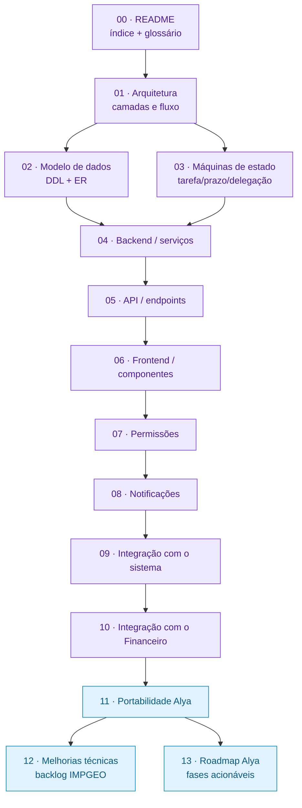

# Blueprint do Subsistema Gerenciamento (PM) — IMPGEO → Alya

> Documentação técnica completa do subsistema **Gerenciamento** (Project Management) do IMPGEO:
> como ele é implementado, como se conecta ao resto do sistema (auth, permissões, subsistemas,
> notificações) e ao **Financeiro**, servindo de **planta (blueprint)** para reimplementá-lo no
> projeto **Alya** (`/Users/fernandocarvalho/alya`).

Este blueprint **expande e atualiza**, no nível técnico/portabilidade, o documento de produto
[`docs/14 - MODULO-GERENCIAMENTO-DE-PROJETOS.md`](../14%20-%20MODULO-GERENCIAMENTO-DE-PROJETOS.md)
(visão de uso/funcionalidades). Onde aquele explica *o que o módulo faz para o usuário*, este
explica *como está construído e como portá-lo*.

---

## Como usar este blueprint

- **Quer entender o IMPGEO atual?** Leia 01 → 10 na ordem.
- **Vai portar pro Alya?** Leia 01–10 para contexto e foque em **11 (mapeamento)** e **13 (roadmap)**.
- **Vai melhorar o IMPGEO?** Vá direto ao **12 (backlog priorizado)**.

| # | Arquivo | Foco |
|---|---------|------|
| 00 | [README](00-README.md) | Índice, glossário, decisões |
| 01 | [ARQUITETURA](01-ARQUITETURA.md) | Camadas, fluxo request→DB, inventário de migrations |
| 02 | [MODELO-DE-DADOS](02-MODELO-DE-DADOS.md) | DDL completo, FKs, CHECKs, triggers, views, ER |
| 03 | [MAQUINAS-DE-ESTADO](03-MAQUINAS-DE-ESTADO.md) | Tarefa (10 estados), prazo, delegação, reabertura, revisão |
| 04 | [BACKEND-SERVICOS](04-BACKEND-SERVICOS.md) | Os 14 serviços de `server/services/pm/` |
| 05 | [API-ENDPOINTS](05-API-ENDPOINTS.md) | Rotas, gates, payloads |
| 06 | [FRONTEND-COMPONENTES](06-FRONTEND-COMPONENTES.md) | Módulos, `_pm/`, compartilhados |
| 07 | [PERMISSOES](07-PERMISSOES.md) | Módulos, defaults por papel, escopos |
| 08 | [NOTIFICACOES](08-NOTIFICACOES.md) | 23 tipos `pm_*`, fanout 3-way |
| 09 | [INTEGRACAO-SISTEMA](09-INTEGRACAO-SISTEMA.md) | 3 pontos de sincronização, auth, navegação |
| 10 | [INTEGRACAO-FINANCEIRO](10-INTEGRACAO-FINANCEIRO.md) | `project_id`, trigger de custo, lucro |
| 11 | [PORTABILIDADE-ALYA](11-PORTABILIDADE-ALYA.md) | Reusar / adicionar / adaptar / podar |
| 12 | [MELHORIAS-TECNICAS](12-MELHORIAS-TECNICAS.md) | Backlog priorizado do IMPGEO |
| 13 | [ROADMAP-ALYA](13-ROADMAP-ALYA.md) | Fases F0→F6 + QA |

---

## Glossário do domínio PM

| Termo | Significado |
|-------|-------------|
| **Projeto** (`projects`) | Trabalho entregável a um cliente; tem etapas, tarefas, valor, custo, prazo, gestor. |
| **Serviço / Template** (`services` + `service_template_*`) | Modelo declarativo reutilizável: etapas + tarefas padrão + dependências + gatilhos. Um projeto pode ser **materializado** a partir de um template. |
| **Etapa** (`project_stages`) | Fase do projeto; tem `version` para suportar retrabalho/diligência (v2, v3). |
| **Tarefa** (`project_tasks`) | Unidade de execução; vive numa **máquina de 10 estados**. |
| **Dependência** (`*_task_deps`) | Trava declarativa: `start_dependency` (libera o início) vs `completion_dependency` (libera a conclusão); alvo pode ser uma tarefa **ou** uma etapa. |
| **Gatilho** (`*_task_triggers`) | Ao concluir a tarefa-fonte, **cria** uma tarefa nova descrita no `payload`. Diferente de dependência (que só libera). |
| **Pomodoro** (`task_work_sessions`) | Controle de tempo server-side: ciclos `running → break`, limite diário de minutos ativos. |
| **Revisão** | Tarefa enviada para aprovação; aprova/reprova por papel (admin direto; manager gera follow-up). |
| **Gestor** | Atalho para `manager`/`admin`/`superadmin` (`_isManagerRole`). |
| **Pedido / request** (`task_*_requests`) | Fluxo de aprovação para prazo, reabertura e delegação (1 pendente por tarefa). |
| **Meta** (`pm_goals`) | KPI operacional com alvo, escopo e janela; progresso calculado ao vivo. |
| **3 pontos de sincronização** | `manifest.ts` (front) + tabela `subsystems` (DB) + catálogo `modules` (seed backend) — precisam sempre concordar. |
| **Fanout de notificação** | Disparo simultâneo em 3 canais: sino (in-app), push (VAPID) e e-mail (opt-in). |

---

## Decisões que orientam a portabilidade para o Alya

1. **PM substitui** o subsistema `gerenciamento` atual do Alya (que hoje é Produtos + Clientes): sai `products`, **`clients` é reaproveitada**, os 4 dashboards placeholder viram reais.
2. **Multiusuário completo**: equipes, delegação, revisão, pomodoro por pessoa — o PM entra inteiro.
3. **Integração financeira completa**: `transactions.project_id` + trigger de custo + lucro orçado + "Vincular a projeto" + relatórios.
4. **Poda do TerraControl/PIX**: o Alya não tem TerraControl, `tc_users`, AbacatePay nem webhook PIX. Tudo que depende disso (`client-service` de sync, `source='terracontrol_pix'`, `terracontrol_id`/`budget_id`, `actor_type='abacatepay'`, notificação `pm_project_paid`, criação de projeto por pagamento) é **removido/adaptado**, não portado.

> Detalhes do mapeamento em [11-PORTABILIDADE-ALYA.md](11-PORTABILIDADE-ALYA.md) e do plano de execução em [13-ROADMAP-ALYA.md](13-ROADMAP-ALYA.md).

---

## Convenções deste blueprint

- **DDL fiel**: todos os trechos de schema foram extraídos das migrations reais (`server/migrations/045→067`), não reconstruídos de memória.
- **Refs de código**: no formato `arquivo:linha` ou `arquivo` + símbolo, sempre ancorados no código atual.
- **Mermaid** em todo diagrama (ER, máquinas de estado, sequência, fluxo, quadrante).
- **pt-BR**, tom técnico e direto.
- O que é *proposta* (não existe ainda) vive **somente** em 12 (melhorias) e 13 (roadmap) — o resto descreve o que está implementado.
