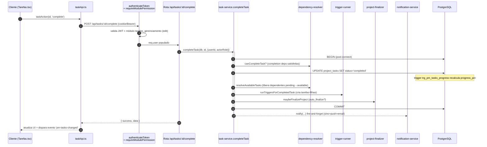

# 01 · Arquitetura

O subsistema Gerenciamento (PM) segue a mesma arquitetura do restante do IMPGEO: **monolito
React/Vite no front + Express/PostgreSQL no back**, sem ORM, sem routers separados, com a
lógica de domínio isolada em **serviços factory** dentro de `server/services/pm/`.

---

## Camadas

```mermaid
flowchart TB
    subgraph FE[Frontend · React 18 + Vite + TS]
        UI[Módulos gerenciamento/modulos/*.tsx]
        PM[_pm/* · modais, widgets, charts]
        API1[_pm/taskApi.ts · _pm/pomodoroApi.ts]
        HOOK[usePermissions · useDialogs · useActiveSession]
        UI --> PM --> API1
        UI --> HOOK
    end

    subgraph BE[Backend · Express monolito server.js]
        MW[Middlewares<br/>authenticateToken · requireModulePermission]
        RT[Rotas /api/pm · /api/projects · /api/services · /api/clients]
        SVC[server/services/pm/* · 14 serviços factory]
        MW --> RT --> SVC
    end

    subgraph DB[(PostgreSQL)]
        TBL[Tabelas PM · projects/project_tasks/...]
        TRG[Triggers · custo + progresso]
        VW[Views · pm_project_health_v]
        FN[CHECKs espelhados em state-machine.js]
    end

    API1 -- fetch JSON /api/* --> MW
    SVC -- db.pool.query / pool.connect --> TBL
    TBL --> TRG
    TBL --> VW

    classDef fe fill:#ede9fe,stroke:#7c3aed,color:#4c1d95;
    classDef be fill:#dcfce7,stroke:#16a34a,color:#14532d;
    classDef db fill:#e0f2fe,stroke:#0284c7,color:#075985;
    class UI,PM,API1,HOOK fe;
    class MW,RT,SVC be;
    class TBL,TRG,VW,FN db;
```

**Princípios estruturais (herdados do IMPGEO, ver memória `feature-checklist`):**

- **Frontend mono-página**: sem router; navegação por `activeTab` em estado; cada subsistema vive
  num subdomínio. Os módulos PM são **autossuficientes** — buscam seus próprios dados via
  `_pm/taskApi.ts`/`pomodoroApi.ts` (não dependem de props de cima).
- **Backend monolítico** (`server/server.js`, ~9k linhas): rotas agrupadas por seção comentada,
  sem routers Express separados.
- **Data layer** (`server/database-pg.js`): SQL puro sobre `pg.Pool`, conversão snake→camel, sem ORM.
- **Serviços**: factory/módulo CommonJS em `server/services/pm/`; recebem `db` e operam sobre `db.pool`.
- **CHECKs do SQL espelhados em código**: `state-machine.js` é a *single source of truth* dos
  domínios (status de projeto/tarefa, sources, actor types) e da matriz de transições.
- **Cálculos automáticos no banco**: custo e progresso do projeto são mantidos por **trigger SQL**,
  não no app (ver 02 e 10).
- **Auditoria por eventos**: `project_events` e `task_events` (+ snapshot JSONB) registram o ciclo de vida.
- **Migrations manuais**: cada `NNN-*.sql` tem par `-rollback.sql`; aplicadas via psql, idempotentes,
  transacionais, com validador final (`RAISE EXCEPTION` se algo faltar).

---

## Fluxo de um request (exemplo: concluir uma tarefa)



A operação inteira roda em **uma transação** (`pool.connect()` manual): dependências liberadas,
gatilhos materializados e finalização do projeto acontecem atômicos com a mudança de status.
As notificações são **fire-and-forget** (nunca derrubam a transação).

---

## Inventário das migrations (016/017 + 045 → 067)

O subsistema é registrado pelas migrations de subsistemas (**016**, **017**) e construído nas
**045 → 067**. Todas idempotentes, transacionais, com rollback e validador.

| Migration | Fase | O que adiciona |
|-----------|------|----------------|
| **016** | infra | Tabela `subsystems` + `subsystem_key` em `modules_catalog` (cria o subsistema `gerenciamento`). |
| **017** | infra | Concede permissões dos módulos do gerenciamento a usuários existentes. |
| **045** | 1 | Estende `clients`/`projects`/`transactions`; `project_events`; colunas financeiras (`*_cents`, `profit_cents` GENERATED); `transactions.project_id`. |
| **046** | 2 | Templates: `service_template_stages/tasks/task_deps/task_triggers` + seed `svc_terracontrol_default`. |
| **047** | 3 | Instâncias reais: `project_stages`, `project_tasks` (10 estados), `project_task_deps/triggers`, `task_events`. Converte `projects.status` p/ português. |
| **048** | 4 | `task_assignments_history` + módulo `tarefas_gerenciamento`. |
| **049** | 5 | Pomodoro: `task_work_sessions`, `pomodoro_events`, `pomodoro_daily_stats`, `user_pomodoro_config`, `task_idle_tracking` + trigger seed-config + módulo `pomodoro_gerenciamento`. |
| **050** | 6 | Revisão (colunas em `project_tasks`), `task_attachments`, `task_help_requests`. |
| **051** | 7 | `users.pm_email_reports`/`pm_report_frequencies`; `pm_report_jobs`. |
| **052** | 8 | Triggers `pm_recalc_project_expenses` (custo) e `pm_project_progress_recalc` (progresso); views `pm_project_health_v`/`pm_overdue_summary_v`; módulo `relatorios_tarefas_gerenciamento`. |
| **053** | 8 | Índices de performance. |
| **054** | 9 | `services.status` (ativo/inativo). |
| **055** | 10 | `clients`: `first_name`/`last_name` + `address` JSONB. |
| **056** | 11 | `project_tasks.actual_seconds`; `task_work_sessions.credited_seconds`. |
| **057** | 12 | Pomodoro custom (relaxa CHECKs de duração; modo `POMODORO_CUSTOM`). |
| **058** | 13 | `pomodoro_overage_requests` (aprovação de tempo extra). |
| **059** | 14 | `user_pomodoro_config.carryover_break_minutes`/`focus_since_break_minutes`. |
| **060** | 15 | `task_due_date_requests` (alteração de prazo com aprovação). |
| **061** | 16 | `project_tasks.submitted_for_review_by_user_id`. |
| **062** | 17 | `gestor_only` em `service_template_tasks` e `project_tasks`. |
| **063** | 18 | `task_uncomplete_requests` (reabertura com aprovação). |
| **064** | 19 | Estende `task_uncomplete_requests.target` com `'pool'`. |
| **065** | 20 | `pm_goals` (metas operacionais). |
| **066** | 21 | `task_delegation_requests` (delegação manager→user com aprovação admin). |
| **067** | 22 | Estende `task_due_date_requests.status` com `'countered'` + `decision_note` (negociação). |

> O DDL completo de cada tabela está em [02-MODELO-DE-DADOS.md](02-MODELO-DE-DADOS.md).
> Para o Alya, a sequência será **consolidada** com a poda do TerraControl (ver 11 e 13).
