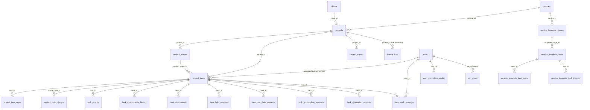
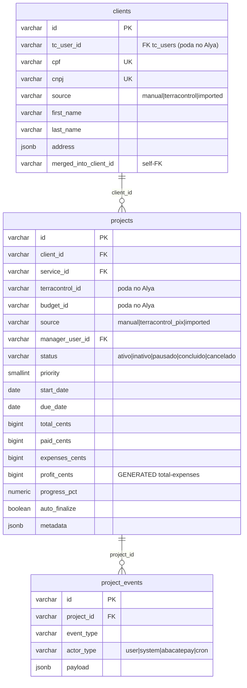
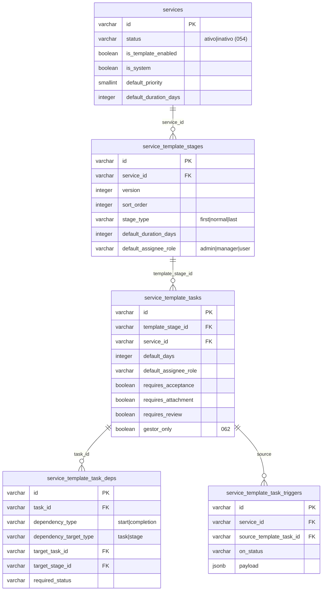
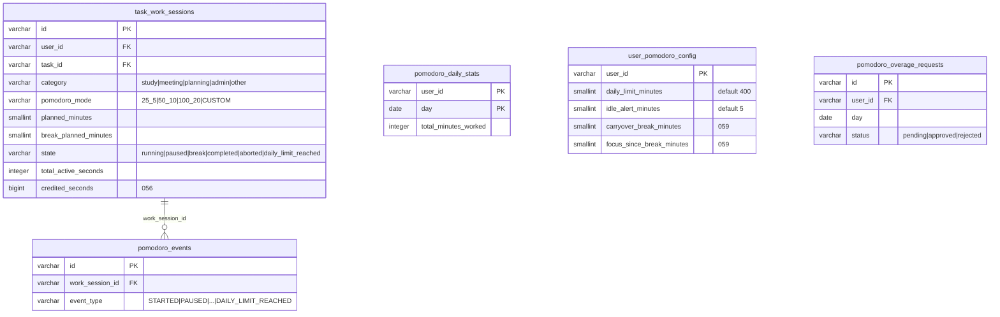
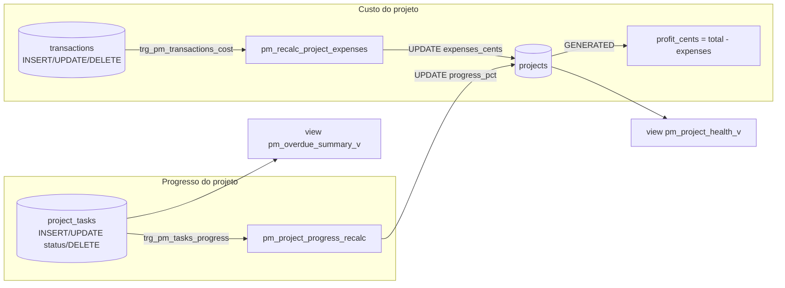

# 02 · Modelo de dados

DDL **fiel** às migrations reais (`server/migrations/045→067`). Convenções do schema PM:

- PKs e FKs são `VARCHAR(255)` (IDs gerados na aplicação, não `serial`).
- Datas de prazo são `DATE`; timestamps de ciclo de vida são `TIMESTAMPTZ`.
- Valores de domínio (status, source, tipos) são `VARCHAR` com **CHECK** — espelhados em
  [`server/services/pm/state-machine.js`](../../server/services/pm/state-machine.js).
- Dados flexíveis ficam em colunas `JSONB` (`metadata`, `template_snapshot`, `payload`).
- Dinheiro do projeto fica em **centavos** (`BIGINT`); `transactions.value` fica em **reais** (`DECIMAL`).

---

## ER global (visão de alto nível)



> O Financeiro entra pela aresta `projects ||--o{ transactions`. Detalhes em [10-INTEGRACAO-FINANCEIRO.md](10-INTEGRACAO-FINANCEIRO.md).

---

## Área 1 — Projeto e cliente (045, 047, 055)



`projects` (colunas adicionadas em **045**; `status` traduzido p/ português em **047**):

```sql
-- 045 (resumo das colunas novas + CHECKs + GENERATED)
ALTER TABLE projects ADD COLUMN client_id VARCHAR(255);   -- FK clients
ALTER TABLE projects ADD COLUMN service_id VARCHAR(255);  -- FK services
ALTER TABLE projects ADD COLUMN terracontrol_id VARCHAR(255); -- FK terracontrol  (PODAR no Alya)
ALTER TABLE projects ADD COLUMN budget_id VARCHAR(255);   -- FK tc_budgets        (PODAR no Alya)
ALTER TABLE projects ADD COLUMN source VARCHAR(16) DEFAULT 'manual';
ALTER TABLE projects ADD COLUMN manager_user_id VARCHAR(255); -- FK users
ALTER TABLE projects ADD COLUMN priority SMALLINT;
ALTER TABLE projects ADD COLUMN start_date DATE;
ALTER TABLE projects ADD COLUMN due_date DATE;
ALTER TABLE projects ADD COLUMN started_at TIMESTAMPTZ;
ALTER TABLE projects ADD COLUMN completed_at TIMESTAMPTZ;
ALTER TABLE projects ADD COLUMN canceled_at TIMESTAMPTZ;
ALTER TABLE projects ADD COLUMN total_cents    BIGINT DEFAULT 0;
ALTER TABLE projects ADD COLUMN paid_cents     BIGINT DEFAULT 0;
ALTER TABLE projects ADD COLUMN expenses_cents BIGINT DEFAULT 0;
ALTER TABLE projects ADD COLUMN profit_cents   BIGINT GENERATED ALWAYS AS
  (COALESCE(total_cents,0) - COALESCE(expenses_cents,0)) STORED;
ALTER TABLE projects ADD COLUMN progress_pct   NUMERIC(5,2) DEFAULT 0;
ALTER TABLE projects ADD COLUMN auto_finalize  BOOLEAN DEFAULT TRUE;
ALTER TABLE projects ADD COLUMN metadata       JSONB DEFAULT '{}'::jsonb;
-- 047: CHECK em português
ALTER TABLE projects ADD CONSTRAINT chk_projects_status
  CHECK (status IN ('ativo','inativo','pausado','concluido','cancelado'));
-- 045: CHECK source (PODAR 'terracontrol_pix' no Alya)
ALTER TABLE projects ADD CONSTRAINT chk_projects_source
  CHECK (source IN ('manual','terracontrol_pix','imported'));
```

`clients` (extensões **045** + **055**): `tc_user_id`(FK tc_users — **podar no Alya**), `cpf`/`cnpj`
(UNIQUE parcial), `source` CHECK `('manual','terracontrol','imported')`, `merged_into_client_id`
(self-FK), `first_name`/`last_name`, e `address` migrada de TEXT para **JSONB**
(`{cep,street,number,complement,neighborhood,city,state}`). `name` é mantida e sincronizada pelo app.

`project_events` (**045**, auditoria):

```sql
CREATE TABLE project_events (
  id          VARCHAR(255) PRIMARY KEY,
  project_id  VARCHAR(255) NOT NULL REFERENCES projects(id) ON DELETE CASCADE,
  event_type  VARCHAR(64)  NOT NULL,
  actor_type  VARCHAR(16)  NOT NULL CHECK (actor_type IN ('user','system','abacatepay','cron')),
  actor_id    VARCHAR(255),
  payload     JSONB DEFAULT '{}'::jsonb,
  created_at  TIMESTAMPTZ DEFAULT NOW()
);
```

---

## Área 2 — Template de serviço (046, 054)



Pontos de design (de **046**):

- `service_template_stages.stage_type` (`first`/`normal`/`last`) + `UNIQUE(service_id, version, sort_order)`.
- `service_template_tasks`: descrição, observação, `default_days`, papel padrão, `requires_*`
  (acceptance/attachment/review), `review_type`, `reviewer_default_role`, `gestor_only` (**062**).
- **Dependência ≠ gatilho**: `*_task_deps` distingue `start_dependency` (libera o início) de
  `completion_dependency` (libera a conclusão), e o alvo pode ser `task` **ou** `stage`
  (CHECK garante que exatamente um `target_*_id` está preenchido, e que não depende de si mesma).
- `*_task_triggers`: ao `on_status` (default `completed`) do source, materializa uma tarefa nova
  descrita no `payload` JSONB.
- Seed de sistema `svc_terracontrol_default` com 5 etapas + 5 tarefas + 1 dependência exemplo
  (esse seed é específico do TerraControl — **não vai para o Alya**).

---

## Área 3 — Etapas e tarefas reais (047, 050, 056, 061, 062)

`project_stages` (**047**): `version` permite "Elaboração v2/v3" dentro do mesmo projeto;
`status` CHECK `('pending','active','completed','skipped')`; `template_snapshot` JSONB guarda a
cópia da etapa-template no momento da materialização.

`project_tasks` (**047**, máquina de 10 estados — DDL real):

```sql
CREATE TABLE project_tasks (
  id                   VARCHAR(255) PRIMARY KEY,
  project_id           VARCHAR(255) NOT NULL REFERENCES projects(id) ON DELETE CASCADE,
  project_stage_id     VARCHAR(255) NOT NULL REFERENCES project_stages(id) ON DELETE CASCADE,
  name                 VARCHAR(255) NOT NULL,
  description          TEXT,
  observation          TEXT,
  sort_order           INTEGER NOT NULL DEFAULT 0,
  status               VARCHAR(24) NOT NULL DEFAULT 'pending'
                         CHECK (status IN (
                           'pending','available','in_progress','pending_acceptance',
                           'pending_review','pending_adjustment','completed',
                           'overdue','refused','canceled')),
  assignee_user_id     VARCHAR(255) REFERENCES users(id) ON DELETE SET NULL,
  captured_by_user_id  VARCHAR(255) REFERENCES users(id) ON DELETE SET NULL,
  created_by_user_id   VARCHAR(255) REFERENCES users(id) ON DELETE SET NULL,
  default_days         INTEGER,
  start_date           DATE,
  due_date             DATE,
  assigned_at          TIMESTAMPTZ,
  accepted_at          TIMESTAMPTZ,
  started_at           TIMESTAMPTZ,
  paused_at            TIMESTAMPTZ,
  completed_at         TIMESTAMPTZ,
  actual_minutes       INTEGER DEFAULT 0,
  estimated_minutes    INTEGER,
  priority             SMALLINT DEFAULT 2,
  review_required      BOOLEAN DEFAULT FALSE,
  acceptance_required  BOOLEAN DEFAULT FALSE,
  reviewer_user_id     VARCHAR(255) REFERENCES users(id) ON DELETE SET NULL,
  manager_review_allowed BOOLEAN DEFAULT TRUE,
  admin_review_allowed   BOOLEAN DEFAULT TRUE,
  refusal_reason       TEXT,
  template_task_id     VARCHAR(255),
  created_by_trigger   BOOLEAN DEFAULT FALSE,
  metadata             JSONB DEFAULT '{}'::jsonb,
  created_at           TIMESTAMPTZ DEFAULT NOW(),
  updated_at           TIMESTAMPTZ DEFAULT NOW()
);
-- 050 (revisão):
ALTER TABLE project_tasks ADD COLUMN submitted_for_review_at TIMESTAMPTZ;
ALTER TABLE project_tasks ADD COLUMN review_decided_at       TIMESTAMPTZ;
ALTER TABLE project_tasks ADD COLUMN review_decision         VARCHAR(12)
  CHECK (review_decision IS NULL OR review_decision IN ('approved','rejected'));
ALTER TABLE project_tasks ADD COLUMN adjustment_notes        TEXT;
-- 056: tempo real | 061: autor do envio p/ revisão | 062: restrita a gestor
ALTER TABLE project_tasks ADD COLUMN actual_seconds BIGINT DEFAULT 0;
ALTER TABLE project_tasks ADD COLUMN submitted_for_review_by_user_id VARCHAR(255);
ALTER TABLE project_tasks ADD COLUMN gestor_only BOOLEAN DEFAULT FALSE;
```

`project_task_deps` / `project_task_triggers` (**047**): cópias editáveis das estruturas do template,
com os mesmos CHECKs (`start|completion`, alvo `task|stage`, não-self). `project_task_triggers.triggered_at`
dá **idempotência** (re-execução não duplica a tarefa criada).

`task_events` (**047**): auditoria do ciclo de vida da tarefa (`event_type`, `actor_type`, `payload`).

`task_assignments_history` (**048**): auditoria de (re)atribuições e colaborações —
`reason ∈ {assign, reassign, help, refused, follow_up}`. Usada pelo escopo do manager em `_canManageTask` (ver 07).

`task_attachments` (**050**): anexos por tarefa (storage em `server/uploads/pm/`).

---

## Área 4 — Pomodoro (049, 056, 057, 058, 059)



- `task_work_sessions`: 1 linha por ciclo. **UNIQUE parcial** `uq_tws_active_per_user` garante só uma
  sessão viva (`running|paused|break`) por usuário (bloqueia start concorrente em 2 abas). CHECK
  `chk_tws_target` exige `task_id` **ou** `category`. CHECKs de `planned_minutes`/`break_planned_minutes`/
  `pomodoro_mode` foram **relaxados** em **057** (custom: 1–240 / 1–60) e **059** (pausa acumulada: 1–1000).
- `pomodoro_daily_stats`: acumulado diário por usuário; `total_minutes_worked` (só ativo) é a base do
  limite de 400 min.
- `user_pomodoro_config`: seed default por **trigger** `trg_seed_pomodoro_config` ao inserir usuário.
- `pomodoro_overage_requests` (**058**): 1 por `(user_id, day)`; tempo acima do teto só conta após aprovação.

---

## Área 5 — Fluxos de aprovação / requests (050, 058, 060, 063, 064, 066, 067)

Todas as tabelas `*_requests` seguem o mesmo padrão: **1 pendente por entidade** (UNIQUE parcial
`WHERE status='pending'`), `decided_by_user_id`/`decided_at`, e CHECK de status.

`task_help_requests` (**050**):

```sql
CREATE TABLE task_help_requests (
  id VARCHAR(255) PRIMARY KEY,
  task_id VARCHAR(255) NOT NULL REFERENCES project_tasks(id) ON DELETE CASCADE,
  requester_user_id VARCHAR(255) NOT NULL REFERENCES users(id) ON DELETE CASCADE,
  target_user_id    VARCHAR(255) NOT NULL REFERENCES users(id) ON DELETE CASCADE,
  message TEXT,
  status  VARCHAR(12) NOT NULL DEFAULT 'pending'
            CHECK (status IN ('pending','accepted','refused','completed')),
  refusal_reason TEXT, resolution_notes TEXT,
  accepted_at TIMESTAMPTZ, refused_at TIMESTAMPTZ, completed_at TIMESTAMPTZ,
  CONSTRAINT chk_help_refusal CHECK (refused_at IS NULL OR refusal_reason IS NOT NULL)
);
```

`task_due_date_requests` (**060** + **067**): alteração de prazo com negociação.

```sql
CREATE TABLE task_due_date_requests (
  id VARCHAR(255) PRIMARY KEY,
  task_id VARCHAR(255) NOT NULL REFERENCES project_tasks(id) ON DELETE CASCADE,
  project_id VARCHAR(255) REFERENCES projects(id) ON DELETE CASCADE,
  requested_by_user_id VARCHAR(255) NOT NULL REFERENCES users(id) ON DELETE CASCADE,
  requester_role VARCHAR(16),            -- 'user' | 'manager'
  current_due_date DATE, requested_due_date DATE,
  justification TEXT,
  status VARCHAR(12) NOT NULL DEFAULT 'pending'
    CHECK (status IN ('pending','countered','approved','rejected')),  -- 'countered' add em 067
  decision_note TEXT,                    -- 067
  decided_by_user_id VARCHAR(255) REFERENCES users(id) ON DELETE SET NULL,
  decided_at TIMESTAMPTZ, created_at TIMESTAMPTZ, updated_at TIMESTAMPTZ
);
CREATE UNIQUE INDEX uq_due_req_task_pending ON task_due_date_requests(task_id) WHERE status='pending';
```

`task_uncomplete_requests` (**063** + **064**): reabertura.
`target ∈ {self, original, pool}` (`pool` adicionado em **064**); `reason` obrigatório;
`original_completer_user_id` guarda quem havia concluído.

`task_delegation_requests` (**066**): manager (não-dono do projeto) delega a um usuário comum;
`requested_by_user_id` (manager), `to_user_id` (usuário), `due_date`, aprovado por admin/superadmin.

---

## Área 6 — Metas e relatórios (051, 065)

`pm_goals` (**065**):

```sql
CREATE TABLE pm_goals (
  id VARCHAR(255) PRIMARY KEY,
  title VARCHAR(255),
  metric VARCHAR(24) NOT NULL
    CHECK (metric IN ('tasks_completed','on_time_pct','projects_completed','focus_minutes')),
  target NUMERIC(12,2) NOT NULL,
  scope  VARCHAR(12) NOT NULL CHECK (scope IN ('self','user','team','global')),
  target_user_id VARCHAR(255) REFERENCES users(id) ON DELETE CASCADE,  -- NULL p/ global
  period VARCHAR(12) NOT NULL CHECK (period IN ('week','month','quarter')),
  period_start DATE NOT NULL, period_end DATE NOT NULL,
  created_by_user_id VARCHAR(255) REFERENCES users(id) ON DELETE SET NULL,
  created_at TIMESTAMPTZ, updated_at TIMESTAMPTZ
);
```

`pm_report_jobs` (**051**): idempotência de envio de relatório por e-mail —
`UNIQUE(user_id, frequency, period_start)`, `status ∈ {sent,error,skipped}`. Em `users`:
`pm_email_reports` (BOOLEAN) e `pm_report_frequencies` (JSONB).

---

## Triggers e views (052)



**Trigger de custo** (`pm_recalc_project_expenses` + `trg_pm_transactions_cost`): a cada
INSERT/UPDATE/DELETE em `transactions`, recalcula `projects.expenses_cents` como
`ROUND(SUM(value)*100)` das transações com `type='Despesa'` vinculadas (`project_id`). No UPDATE,
recalcula também o `project_id` antigo se ele mudou. `profit_cents` é coluna **GENERATED**.

**Trigger de progresso** (`pm_project_progress_recalc` + `trg_pm_tasks_progress`): em
INSERT/UPDATE de `status`/DELETE de `project_tasks`, recalcula `progress_pct` =
`completed / (total não-canceladas e não-recusadas) * 100`.

**Views**:
- `pm_project_health_v`: por projeto — `progress_pct`, `total/expenses/profit_cents`,
  `days_to_deadline`, `expense_ratio_pct`, `task_count`, `overdue_count`.
- `pm_overdue_summary_v`: por responsável — `overdue_tasks`, `oldest_due`.

> Esses dois triggers + as views são o coração da **integração financeira** (ver 10) e, no Alya,
> portam quase **verbatim** porque `transactions.value DECIMAL` + `type='Despesa'` já existem lá.
