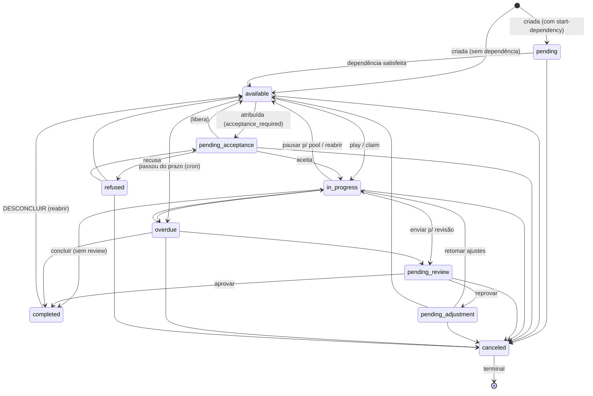
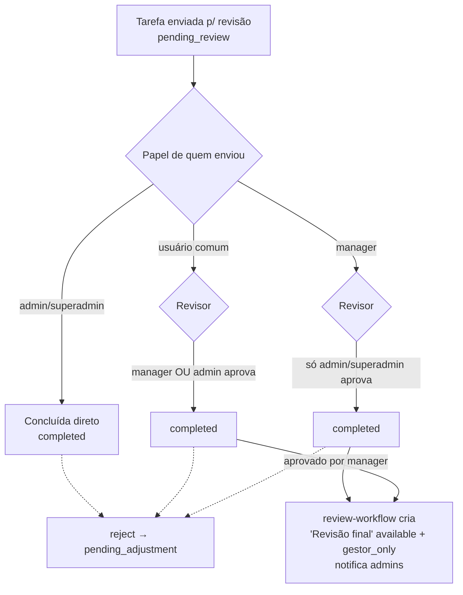
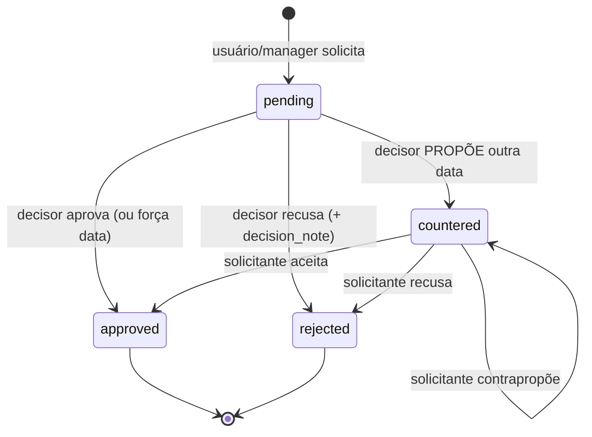
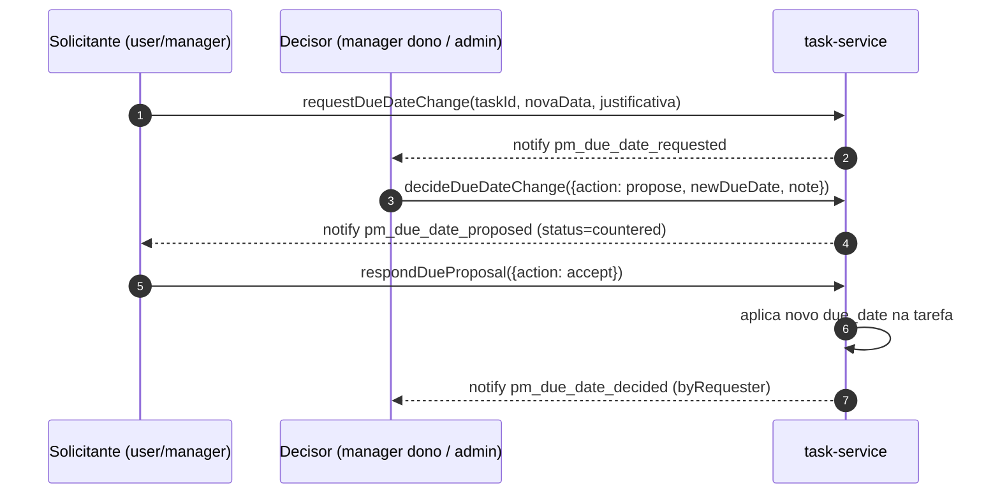
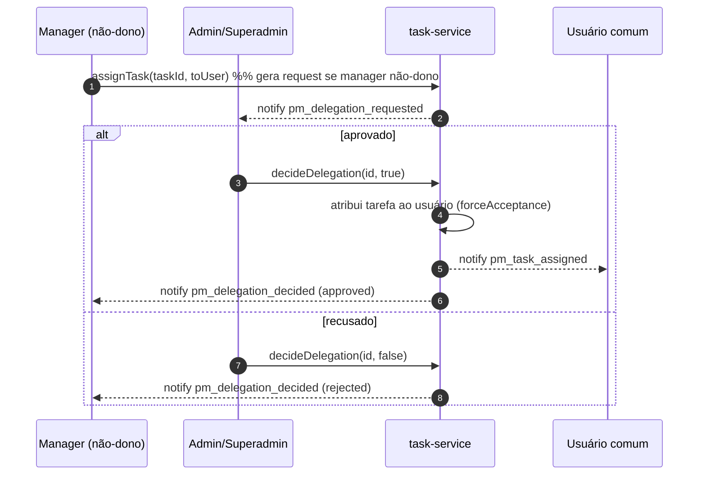
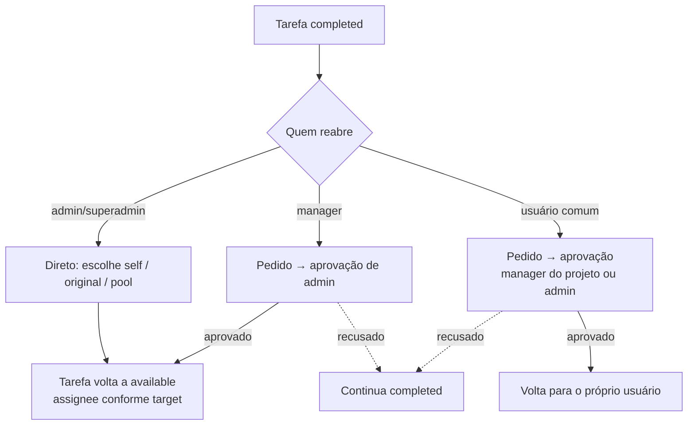
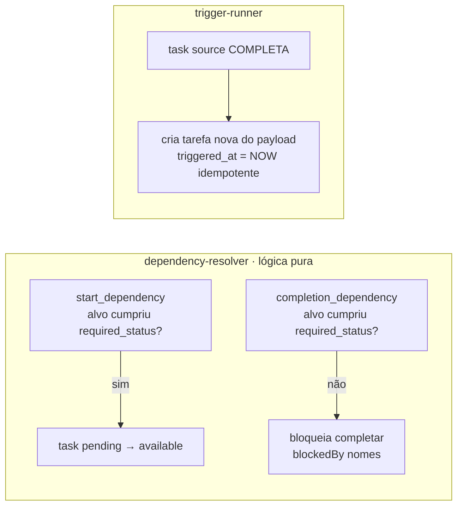

# 03 · Máquinas de estado

O coração do PM é a **máquina de estados da tarefa** (10 estados) e quatro fluxos de aprovação que
orbitam em volta dela: **revisão por papel**, **negociação de prazo**, **delegação** e **reabertura**.
A fonte da verdade da matriz de transição é
[`server/services/pm/state-machine.js`](../../server/services/pm/state-machine.js) (`ALLOWED_TRANSITIONS`),
espelhando o CHECK de `project_tasks.status`.

---

## Tarefa — 10 estados

Matriz exata (de `ALLOWED_TRANSITIONS`):

| De \ Para | available | in_progress | pending_acceptance | pending_review | pending_adjustment | completed | overdue | refused | canceled |
|-----------|:--:|:--:|:--:|:--:|:--:|:--:|:--:|:--:|:--:|
| **pending** | ✓ | | | | | | | | ✓ |
| **available** | | ✓ | ✓ | | | | ✓ | | ✓ |
| **pending_acceptance** | ✓ | ✓ | | | | | | ✓ | ✓ |
| **in_progress** | ✓ | | | ✓ | | ✓ | ✓ | | ✓ |
| **pending_review** | | | | | ✓ | ✓ | | | ✓ |
| **pending_adjustment** | ✓ | ✓ | | | | | | | ✓ |
| **overdue** | | ✓ | | ✓ | | ✓ | | | ✓ |
| **refused** | ✓ | | ✓ | | | | | | ✓ |
| **completed** | ✓ | | | | | | | | |
| **canceled** | | | | | | | | | |

Pontos não-óbvios:
- **`completed` deixou de ser terminal**: pode ser **reaberta** (desconcluída) e volta para
  `available` — o responsável precisa dar play de novo (não volta direto para `in_progress`).
- **`canceled` é o único estado terminal**.
- `overdue` é definido por **cron** (a cada 1 min, `report-service.detectAndMarkOverdue`), não por ação do usuário.
- `refused` volta a tarefa para o pool (`available`) com `assignee` limpo.

---

## Revisão por papel de quem enviou (050, 061)

Quando uma tarefa exige revisão (`review_required`), **quem a aprova depende do papel de quem a
enviou** (`submitted_for_review_by_user_id`, da migration 061):

- **admin/superadmin conclui** → sem revisão (vai direto a `completed`).
- **usuário comum** com review → **manager OU admin** revisa.
- **manager** com review → só **admin/superadmin** revisa.
- Quando um **manager aprova**, `review-workflow.createAdminFollowUp` cria uma tarefa "Revisão final"
  (`available` + `gestor_only`, sem responsável) e notifica os admins — fechando o controle de dois níveis.

---

## Negociação de prazo (060, 067)

`task_due_date_requests` — 1 pendente por tarefa. Admin/superadmin altera o prazo **direto**;
usuário e manager **pedem aprovação**. O decisor pode aprovar, recusar, **forçar** uma data ou
**propor** uma contraproposta (`status='countered'`), devolvendo a decisão ao solicitante.

Quem aprova: pedido de **usuário** → manager do projeto **ou** admin/superadmin; pedido de
**manager** → só admin/superadmin.

---

## Delegação (066)

Quando um **manager que não é dono do projeto** delega uma tarefa a um usuário comum, vira um
pedido que um **admin/superadmin** precisa aprovar antes de a tarefa ir de fato ao usuário.

> Detalhe de implementação: enquanto há delegação pendente, a tarefa é **excluída do pool**
> de "disponíveis" e o `claim` é bloqueado (evita que a tarefa seja pega por outro no meio do fluxo).
> Manager **dono** do projeto (ou admin) atribui direto, sem request.

---

## Reabertura / desconcluir (063, 064)

`task_uncomplete_requests` — `target ∈ {self, original, pool}`.

- **admin/superadmin**: reabre direto; escolhe `self` (capturar), `original` (devolver a quem
  concluiu) ou `pool` (deixar disponível).
- **manager**: reabre nos projetos dele, mas o pedido precisa de **aprovação de admin**.
- **usuário comum**: sempre `target='self'`; o pedido precisa de **aprovação** (manager do projeto ou admin).
- Em todos os casos a tarefa volta para `available` (não `in_progress`) — o responsável dá play de novo.
  Notificações: `pm_uncomplete_requested`, `pm_uncomplete_decided`, `pm_task_uncompleted`, `pm_uncomplete_self_notice`.

---

## Dependências e gatilhos (resolução)

Não são "estados" da tarefa, mas governam as transições `pending → available` e a permissão de concluir:

- **start_dependency**: a tarefa `pending` vira `available` quando o alvo (task/stage) atinge
  `required_status` (default `completed`). Calculado por `dependency-resolver.resolveAvailableTasks`.
- **completion_dependency**: bloqueia a **conclusão** até o alvo cumprir; `canCompleteTask` retorna
  `{ok, blockedBy}` (os nomes alimentam o aviso em modal no front — ver 06).
- **gatilho**: ao concluir a tarefa-fonte, `trigger-runner.runTriggersForCompletedTask` materializa
  a tarefa descrita no `payload`, com idempotência via `triggered_at`.

> A orquestração de tudo isso (transação única: status → libera deps → roda triggers → finaliza
> projeto → notifica) está em [04-BACKEND-SERVICOS.md](04-BACKEND-SERVICOS.md).
