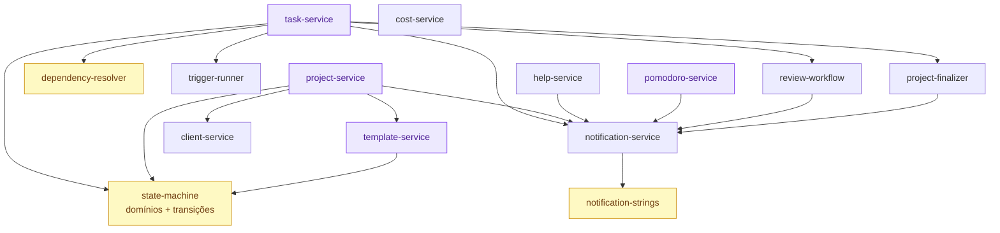
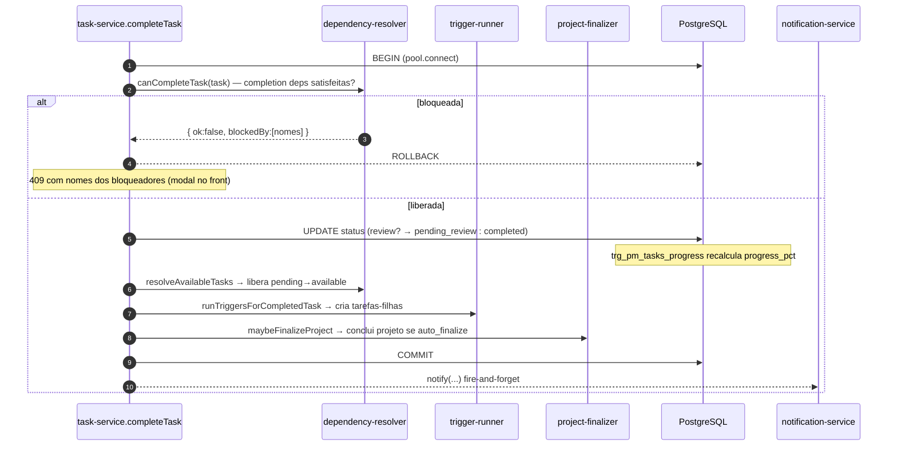

# 04 · Backend — serviços

Toda a lógica de domínio do PM vive em **14 serviços** dentro de
[`server/services/pm/`](../../server/services/pm/) (módulos CommonJS, recebem `db` e operam sobre
`db.pool`). O `server.js` só faz autenticação, gate de permissão e *casca* HTTP, delegando aos serviços.

| Serviço | Linhas | Responsabilidade |
|---------|:------:|------------------|
| `state-machine.js` | 155 | SSoT dos domínios CHECK + matriz de transição (ver 03). |
| `task-service.js` | 1236 | Ciclo de vida da tarefa, atribuição, prazo, delegação, reabertura, revisão. |
| `template-service.js` | 669 | CRUD do template (stages/tasks/deps/triggers) + versionamento. |
| `pomodoro-service.js` | 645 | Sessões de foco, limite diário, overage. |
| `project-service.js` | 525 | CRUD + leitura aninhada + materialização de projeto a partir de template. |
| `report-service.js` | 350 | Detecção de atraso (cron), relatórios por e-mail, produtividade/saúde/equipes. |
| `goals-service.js` | 208 | Metas operacionais (KPIs) com progresso ao vivo. |
| `dashboard-service.js` | 169 | Agregação do dashboard pessoal/global. |
| `dependency-resolver.js` | 121 | Lógica pura de dependências (sem I/O). |
| `help-service.js` | 118 | Pedidos de ajuda em tarefas. |
| `client-service.js` | 107 | Sync `tc_users → clients` (**podar no Alya**). |
| `notification-service.js` | 91 | Fanout 3-way (sino/push/e-mail). |
| `trigger-runner.js` | 88 | Materializa tarefas a partir de gatilhos. |
| `notification-strings.js` | 84 | Textos pt-BR por tipo de notificação. |
| `review-workflow.js` | 50 | Lógica de follow-up de revisão. |
| `project-finalizer.js` | 49 | Finaliza projeto quando todas as tarefas vivas concluem. |
| `cost-service.js` | 45 | Vínculo transação↔projeto + leitura financeira. |

> 17 arquivos no total (a tabela acima conta os serviços de domínio; `state-machine`/`notification-strings`
> são "biblioteca" mais que serviço). O número 14 do plano refere-se aos serviços de comportamento.

---

## Grafo de dependências entre serviços



`state-machine`, `dependency-resolver` e `notification-strings` são **puros** (sem I/O) — fáceis de
testar e de portar. `task-service` é o orquestrador central.

---

## task-service.js (orquestrador)

Exports (de `module.exports`):

```
getTask · appendTaskEvent · assignTask · setTaskDueDate
requestDueDateChange · decideDueDateChange · respondDueDateProposal
listPendingDueDateRequests · listMyDueProposals
requestDelegation · decideDelegation · listPendingDelegations
claimTask · claimTasksBulk · completionPrereqs
acceptTask · refuseTask · startTask · pauseTask · resumeTask · cancelTask
completeTask · submitForReview · approveReview · rejectReview
uncompleteTask · listPendingUncompleteRequests · decideUncomplete
listPendingReviews · listMyTasks · listAvailableUnassignedTasks · listProjectTasks
```

Agrupados por responsabilidade:

| Grupo | Funções | Notas |
|-------|---------|-------|
| **Transições simples** | `acceptTask`, `refuseTask`, `startTask`, `pauseTask`, `resumeTask`, `cancelTask` | Validam contra `canTransitionTask`; gravam `task_events`. `refuseTask` → `available` com assignee NULL. |
| **Conclusão** | `completeTask({userId, actorRole})` | Orquestra a transação composta (abaixo). Admin pula revisão. |
| **Revisão** | `submitForReview`, `approveReview`, `rejectReview`, `listPendingReviews` | Gateado por papel de quem enviou (`submitted_for_review_by_user_id`); manager-approval cria follow-up. |
| **Atribuição/captura** | `assignTask({forceAcceptance})`, `claimTask`, `claimTasksBulk`, `completionPrereqs`, `listAvailableUnassignedTasks` | `claim` respeita `gestor_only` e delegação pendente. |
| **Prazo** | `setTaskDueDate`, `requestDueDateChange`, `decideDueDateChange({action})`, `respondDueDateProposal`, `listPendingDueDateRequests`, `listMyDueProposals` | `action ∈ {approve, reject, force, propose}`; negociação `pending↔countered`. |
| **Delegação** | `requestDelegation`, `decideDelegation`, `listPendingDelegations` | Manager não-dono gera request; admin decide. |
| **Reabertura** | `uncompleteTask`, `listPendingUncompleteRequests`, `decideUncomplete` | `target ∈ {self, original, pool}`; user/manager precisam de aprovação. |
| **Leitura** | `listMyTasks`, `listProjectTasks` | Enriquecidas com nomes (`assignee_name`, `project_name`) e `completion_prereqs`. |

### `completeTask` — a transação composta



---

## project-service.js

```
TC_SERVICE_ID · appendProjectEvent · getProjectById · listProjects · listProjectEvents
getProjectWithDetails · createProjectFromTemplate · createProjectFromTerraControlPayment
cloneStageAsNewVersion · skipStage · reorderStages
```

- **`createProjectFromTemplate(db, serviceId, projectId, opts)`**: clona TUDO do template (stages →
  tasks → deps → triggers) para o projeto real, atômico. É o caminho de criação **manual** de projeto.
- **`createProjectFromTerraControlPayment(...)`**: cria projeto a partir do pagamento PIX —
  **específico do TerraControl, podar no Alya**.
- `getProjectWithDetails`: leitura aninhada (stages + tasks + deps/triggers + events) com `_annotateCanManage`.
- `cloneStageAsNewVersion`/`skipStage`/`reorderStages`: gestão de etapas (diligência v2/v3, pular, reordenar).

## template-service.js

CRUD do template: `getServiceTemplate`, `createStage/updateStage/deleteStage/reorderStages`,
`createTask/updateTask/deleteTask`, `createDependency/deleteDependency`, `createTrigger/deleteTrigger`,
`versionBump`, `importTemplateStructure`. Constantes `DEP_TYPES`/`TARGET_TYPES`/`STAGE_TYPES`.
Valida ciclos de dependência (`_wouldCreateCycle`, exposto p/ teste).

## pomodoro-service.js

Sessões server-side. Exports principais: `startSession`, `pauseSession`/`resumeSession`,
`pauseSessionForTask`/`resumeSessionForTask`, `completeActive`, `finishBreak`/`skipBreak`,
`abortSession`/`autoCompleteSessionForTask`, `heartbeat`/`abortStaleSessions`, `getStats`,
`getOverageToday`/`requestOverage`/`listPendingOverages`/`decideOverage`, `getConfig`/`updateConfig`.
Constantes `MODE_BY_MINUTES`/`BREAK_BY_MINUTES`/`VALID_MINUTES`/`STALE_AFTER_MIN`. Limite diário
400 min ativos (teto 1,25× → overage com aprovação); só tempo ativo conta; pular pausa acumula intervalo.

## dependency-resolver.js (puro)

`DEFAULT_REQUIRED_STATUS`, `isDependencySatisfied`, `resolveAvailableTasks`, `canCompleteTask`,
`canStartTask`. Sem I/O — recebe `{tasks, stages, deps}` e devolve decisões. Base dos testes unitários.

## trigger-runner.js

`runTriggersForCompletedTask(db, sourceTaskId, opts)`: carrega triggers com `on_status` satisfeito e
`triggered_at IS NULL`, materializa cada tarefa do `payload`, marca `triggered_at=NOW()` (idempotência).
Roda dentro da transação de conclusão.

## review-workflow.js

`shouldCreateFollowUp(reviewerRole)` (true se manager) e `createAdminFollowUp(...)`: cria a tarefa
"Revisão final" (`available` + `gestor_only`, sem responsável) e notifica os admins.

## project-finalizer.js

`maybeFinalizeProject(exec, db, projectId)`: se `auto_finalize` e todas as tarefas vivas
(¬canceled ∧ ¬refused) estão `completed`, marca o projeto como `concluido` e grava evento.

## help-service.js

`createHelpRequest`, `acceptHelp`, `refuseHelp` (motivo obrigatório), `markCollaborationComplete`,
`listIncomingHelp`. Registra colaborador em `task_assignments_history` (`reason='help'`).

## cost-service.js / dashboard-service.js / goals-service.js / report-service.js

- **cost-service**: `linkTransactionToProject`, `linkTransactionsToProject`, `getProjectFinancials`.
  Só LÊ/vincula — o custo é mantido por **trigger SQL** (ver 02 e 10).
- **dashboard-service**: `getDashboard(db, user, {from,to})` → `{role, isGestor, personal, global?}`.
- **goals-service**: `listGoals`, `createGoal`, `updateGoal`, `deleteGoal` + `METRICS`/`PERIODS`/`SCOPES`.
  Progresso calculado **ao vivo** sobre tarefas/projetos/pomodoro.
- **report-service**: `detectAndMarkOverdue` (cron 1 min), `sendDueReports`, `buildReportData`/
  `renderReportHtml`, `productivityByUser`, `projectsHealth`, `teamsReport`. Timezone BRT (`America/Sao_Paulo`).

## notification-service.js / notification-strings.js / client-service.js

- **notification-service**: `notify`, `notifyAdmins`, `notifyRoles`, `notifyManagersAndAdmins` (ver 08).
- **notification-strings**: `build(type, payload)` + dicionário `STRINGS` (28 tipos `pm_*`).
- **client-service**: `findOrCreateFromTcUser`, `serializeAddress` — sync TerraControl→clients
  (**substituído por CRUD simples no Alya**).

> Para o Alya: portar todos exceto `client-service.findOrCreateFromTcUser` e
> `project-service.createProjectFromTerraControlPayment` (poda TerraControl/PIX). Ver 11 e 13.
