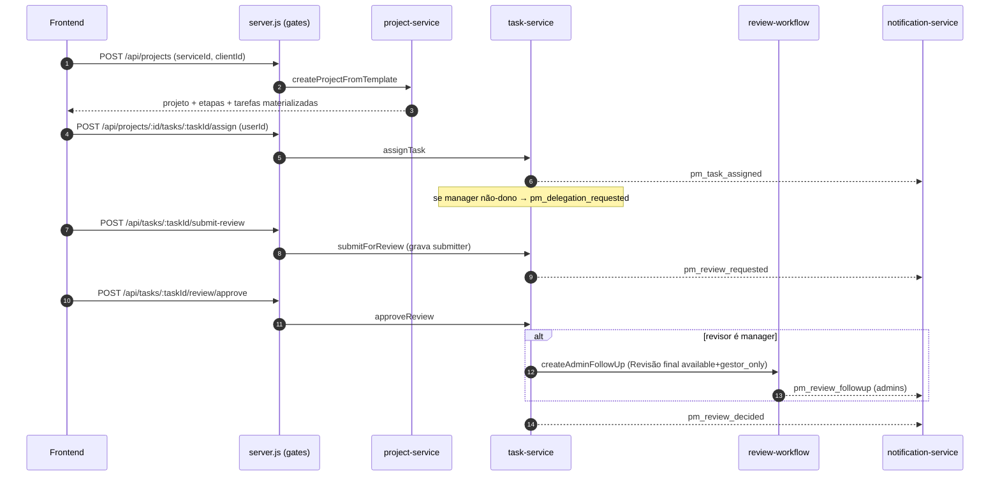

# 05 · API — endpoints

Todas as rotas do PM vivem em [`server/server.js`](../../server/server.js) (sem routers separados),
agrupadas por seção. Cada rota é protegida por `authenticateToken` + `requireModulePermission(moduleKey, level)`
(admin/superadmin têm bypass — ver 07). Resposta padrão: `{ success: boolean, data?, error? }`.

Convenção de gates abaixo: `tarefas` = `tarefas_gerenciamento`, `REL` = `relatorios_tarefas_gerenciamento`,
`GOALS` = `metas_gerenciamento`, `dash` = `dashboard_gerenciamento`.

---

## Clientes (`clients`)

| Método | Rota | Gate |
|--------|------|------|
| GET | `/api/clients` | clients/view |
| POST | `/api/clients` | clients/edit |
| PUT | `/api/clients/:id` | clients/edit |
| DELETE | `/api/clients/:id` | clients/edit |
| DELETE | `/api/clients` (bulk) | clients/edit |

## Projetos (`projects`)

| Método | Rota | Gate |
|--------|------|------|
| GET | `/api/projects` | projects/view |
| POST | `/api/projects` | projects/edit |
| GET | `/api/projects/:id` | projects/view |
| PUT | `/api/projects/:id` | projects/edit |
| DELETE | `/api/projects/:id` · `/api/projects` (bulk) | projects/edit |
| POST | `/api/projects/:id/stages/reorder` | projects/edit |
| POST | `/api/projects/:id/stages/:stageId/skip` | projects/edit |
| POST | `/api/projects/:id/stages/:stageId/clone-as-version` | projects/edit |
| GET | `/api/projects/:id/tasks` | tarefas/view |
| GET | `/api/projects/:id/transactions` | projects/view |

## Tarefas — atribuição e transições (`tarefas_gerenciamento`)

| Método | Rota | Função de serviço |
|--------|------|-------------------|
| POST | `/api/projects/:id/tasks/:taskId/assign` | `assignTask` (gera delegação se manager não-dono) |
| POST | `/api/tasks/:taskId/claim` | `claimTask` |
| POST | `/api/tasks/claim-bulk` | `claimTasksBulk` |
| GET | `/api/me/tasks` | `listMyTasks` |
| GET | `/api/me/available-tasks` | `listAvailableUnassignedTasks` |
| POST | `/api/tasks/:taskId/submit-review` | `submitForReview` |
| POST | `/api/tasks/:taskId/review/approve` | `approveReview` |
| POST | `/api/tasks/:taskId/review/reject` | `rejectReview` |
| POST | `/api/tasks/:taskId/uncomplete` | `uncompleteTask` |
| POST | `/api/tasks/:taskId/attachments` · GET lista · GET `/api/pm/attachments/:id/download` · DELETE | anexos |
| POST | `/api/tasks/:taskId/help-request` · GET `/api/me/help-requests` | `help-service` |

> As transições diretas (`accept/refuse/start/pause/resume/complete/cancel`) entram por rotas
> `/api/tasks/:taskId/<action>` consumidas pelo helper `taskAction` do front (ver 06).

## Prazo, delegação, reabertura, revisão (filas de aprovação)

| Método | Rota | Papel |
|--------|------|-------|
| POST | `/api/tasks/:taskId/due-date` | solicita/edita prazo |
| GET | `/api/pm/due-date-requests/pending` | fila do decisor |
| POST | `/api/pm/due-date-requests/:id/decide` | `decideDueDateChange` (approve/reject/force/propose) |
| GET | `/api/pm/due-date-requests/mine` | minhas propostas |
| POST | `/api/pm/due-date-requests/:id/respond` | `respondDueDateProposal` (accept/reject/propose) |
| GET | `/api/pm/delegation-requests` · POST `/:id/decide` | fila de delegação (admin) |
| GET | `/api/pm/uncomplete-requests` · POST `/:id/decide` | fila de reabertura |
| GET | `/api/pm/pending-reviews` | fila de revisão |

## Pomodoro (`pomodoro_gerenciamento`)

| Método | Rota | Função |
|--------|------|--------|
| GET | `/api/pomodoro/active` | `getActiveSession` |
| POST | `/api/pomodoro/sessions` (+ `/:id/<action>`) | `startSession` / pause/resume/stop/skip-break/... |
| GET | `/api/pomodoro/stats` | `getStats` |
| GET/POST | `/api/pomodoro/overage` | `getOverageToday` / `requestOverage` |
| GET | `/api/pomodoro/overage/pending` · POST `/:id/decide` | fila de overage (gestor) |
| GET/PUT | `/api/pomodoro/config` | `getConfig` / `updateConfig` |

## Serviços e template (`services`)

| Método | Rota |
|--------|------|
| GET/POST | `/api/services` · PUT/DELETE `/api/services/:id` |
| GET | `/api/services/:id/template` |
| POST/PUT/PATCH/DELETE | `/api/services/:id/template/stages[...]` |
| POST/PATCH/DELETE | `/api/services/:id/template/tasks[...]` |
| POST/DELETE | `.../dependencies[...]` · `.../triggers[...]` |
| POST | `/api/services/:id/template/version-bump` · `/api/services/:id/template/import` |

## Dashboard, metas, relatórios e financeiro

| Método | Rota | Gate |
|--------|------|------|
| GET | `/api/pm/dashboard` | dash/view |
| GET/POST/PATCH/DELETE | `/api/pm/goals[...]` | GOALS |
| GET | `/api/pm/reports/productivity` · `/projects-health` · `/teams` | REL |
| GET | `/api/pm/reports/financials` | REL |
| GET | `/api/pm/reports/export` · `/export-pdf` | REL |
| POST | `/api/transactions/:id/link-project` · `/api/transactions/link-project-bulk` | projects/edit |
| GET | `/api/pm/unlinked-transactions` | projects/edit |
| GET | `/api/pm/users` · `/api/pm/assignable-users` | tarefas |
| GET | `/api/pm/project-leads` | projects |

---

## Fluxo end-to-end (criar projeto → atribuir → concluir → revisar)

> Os payloads detalhados de cada rota seguem o contrato dos serviços (ver 04). O front consome tudo
> via `_pm/taskApi.ts` e `_pm/pomodoroApi.ts` (ver 06), com tratamento de erro uniforme `{success, error, code}`.
