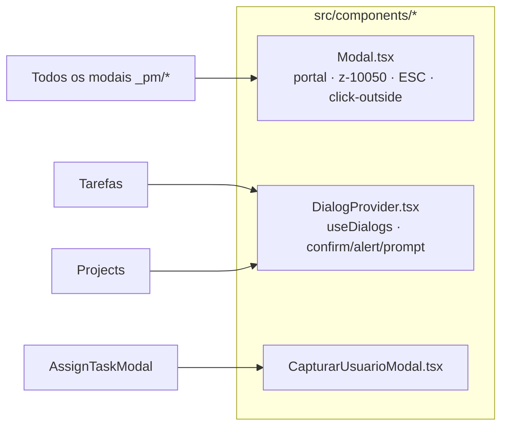

# 06 · Frontend — componentes

O front do PM vive em [`src/subsistemas/gerenciamento/modulos/`](../../src/subsistemas/gerenciamento/modulos/):
**10 módulos raiz** (registrados como abas) + a pasta privada **`_pm/`** (19 arquivos: modais, widgets,
helpers de API, charts). Os módulos são **autossuficientes** — buscam seus próprios dados via
`_pm/taskApi.ts`/`pomodoroApi.ts` (não recebem dados por props do `App.tsx`).

---

## Árvore de componentes

```mermaid
flowchart TD
    App[App.tsx · activeTab] --> Tarefas
    App --> Dashboard[DashboardGerenciamento]
    App --> Metas[MetasGerenciamento]
    App --> Projecao[ProjecaoGerenciamento]
    App --> RelGer[RelatoriosGerenciamento]
    App --> RelTar[RelatoriosTarefas]
    App --> Projects
    App --> Services
    App --> Clients
    App --> Pomodoro
    App --> Widget[PomodoroFloatingWidget · sempre montado]

    Tarefas --> Banner[PendingTasksBanner]
    Tarefas --> M1[ClaimTaskModal · AssignTaskModal]
    Tarefas --> M2[TaskReviewModal · TaskDueDateModal · DueProposalModal]
    Tarefas --> M3[UncompleteTaskModal · HelpRequestModal]
    Tarefas --> M4[PomodoroStartModal · IdleAlertModal]
    Projects --> PDP[ProjectDetailPage]
    Projects --> TIM[TemplateImportModal]
    Projects --> LTM[LinkTransactionModal]
    Services --> STE[ServiceTemplateEditor]
    Dashboard --> Charts[_pm/charts.tsx]
    Metas --> Charts

    Tarefas -. taskApi .-> API[(/api/*)]
    Pomodoro -. pomodoroApi .-> API

    classDef mod fill:#ede9fe,stroke:#7c3aed,color:#4c1d95;
    classDef shared fill:#dcfce7,stroke:#16a34a,color:#14532d;
    class Tarefas,Dashboard,Metas,Projecao,RelGer,RelTar,Projects,Services,Clients,Pomodoro mod;
    class API,Charts shared;
```

---

## Módulos raiz

| Módulo | Linhas | `usePermissions` | Função |
|--------|:------:|------------------|--------|
| `Projects.tsx` | 949 | `projects` | CRUD de projetos; abre `ProjectDetailPage`, `TemplateImportModal`, `LinkTransactionModal`. |
| `Clients.tsx` | 763 | `clients` | CRUD de clientes (cpf/cnpj, address JSONB, first/last name). |
| `Tarefas.tsx` | 544 | `tarefas_gerenciamento` | Painel pessoal: tarefas por status + filas de prazo/reabertura/delegação/revisão/ajuda. |
| `Services.tsx` | 409 | `services` | Catálogo de serviços + `ServiceTemplateEditor`. |
| `MetasGerenciamento.tsx` | 323 | (role) | Metas (KPIs) com `ConicGauge`. |
| `RelatoriosTarefas.tsx` | 256 | `relatorios_tarefas_gerenciamento` | 3 abas: produtividade / saúde de projetos / equipes; export XLSX/PDF. |
| `Pomodoro.tsx` | 196 | `pomodoro_gerenciamento` | Estatísticas + config + fila de overage. |
| `DashboardGerenciamento.tsx` | 196 | `dashboard_gerenciamento` | KPIs pessoais + (gestor) visão global; recharts via `charts.tsx`. |
| `ProjecaoGerenciamento.tsx` | 110 | — | Projeção operacional. |
| `RelatoriosGerenciamento.tsx` | 110 | — | Relatórios consolidados. |

`Tarefas.tsx` é o módulo mais rico: consome `/me/tasks`, `/me/available-tasks`, `/pm/pending-reviews`,
`/me/help-requests`, `/pm/due-date-requests/{pending,mine}`, `/pm/uncomplete-requests`,
`/pm/delegation-requests`, e dispara os eventos `pm-tasks-changed` / `pm-pomodoro-changed` para
refetch cross-módulo.

---

## Pasta `_pm/` (19 arquivos)

**Helpers de API** (a fronteira HTTP do front):
- `taskApi.ts` (167) — tipos (`PmTask`, `DueDateRequest`, `UncompleteRequest`, `DelegationRequest`,
  `HelpRequest`, `PmUser`, `CompletionPrereq`) + funções (`fetchMyTasks`, `fetchAvailableTasks`,
  `taskAction`, `claimTask(sBulk)`, `setTaskDueDate`/`decideDueRequest`/`respondDueProposal`,
  `uncompleteTask`/`decideUncompleteRequest`, `decideDelegation`, `reviewApprove/Reject`, `createHelpRequest`/`helpAction`).
  Parser uniforme de erro (`{success, error, code}`).
- `pomodoroApi.ts` (131) — tipos `PomodoroSession`/`OverageRequest`, `getActive`/`startSession`/
  `sessionAction`/`getStats`/overage/config, hook `useActiveSession()` (reconciliação 30s + heartbeat 60s),
  `MODE_OPTIONS`, `fmtClock`.

**Charts** (`charts.tsx`, 256): `StatCard`, `SectionPanel`, `ChartShell`, `Donut`/`DonutLegend`,
`Bars`, `AreaTrend`, `ProgressBar`, `ConicGauge` (recharts + dark mode) + `STATUS_COLORS`/`STATUS_LABELS`.

**Páginas/editores grandes**:
- `ServiceTemplateEditor.tsx` (657) — editor do template (stages/tasks/deps/triggers).
- `ProjectDetailPage.tsx` (548) — detalhe do projeto (etapas, tarefas, timeline, progresso).
- `PomodoroFloatingWidget.tsx` (343) — widget sempre-montado; arrastável; Picture-in-Picture.
- `TemplateImportModal.tsx` (299) — importar template ao criar projeto.

**Modais** (todos usam `<Modal>`): `PomodoroStartModal` (191), `PendingTasksBanner` (130),
`ClaimTaskModal` (105), `LinkTransactionModal` (103), `UncompleteTaskModal` (103), `AssignTaskModal` (95),
`PmEmailReportsPanel` (80), `TaskDueDateModal` (78), `DueProposalModal` (77), `TaskReviewModal` (71),
`HelpRequestModal` (60), `IdleAlertModal` (27).

---

## Componentes compartilhados que o PM exige

- **`Modal.tsx`** — wrapper obrigatório (memória do projeto): `createPortal` para `body`, z-index alto
  (`z-[10050]`), ESC/click-outside (bloqueáveis com `destructive`), scroll lock. **Não existe no Alya → portar (F0).**
- **`DialogProvider.tsx`** — `useDialogs()` → `confirm`/`alert`/`prompt` baseados em promessa (substitui
  `window.*`). **Não existe no Alya → portar (F0).**
- **`CapturarUsuarioModal.tsx`** — seleção de usuário (usado em atribuição/ajuda).

---

## Padrões de front (a replicar no Alya)

- **Autossuficiência**: cada módulo carrega seus dados em `useEffect` + listener de evento
  (`pm-tasks-changed`/`pm-pomodoro-changed`) → refetch. **Isso encaixa bem no `App.tsx` monolítico do
  Alya** porque os módulos não dependem do prop-drilling de estado.
- **`usePermissions(moduleKey)`** controla render de ações (view/edit). Equivalente no Alya:
  `usePermissions(module)` + `hasModuleView/hasModuleEdit` (ver 07/11).
- **Dark mode**: classes `dark:!bg-[#243040]`, paleta violet do subsistema.
- **recharts**: já existe no Alya (hoje só em Admin/Statistics) — `charts.tsx` porta direto.
- **Tratamento de erro**: o parser de `taskApi.ts` lê `{success, error, code}` e lança `Error` com `code`
  para a UI exibir avisos específicos (ex.: bloqueio de conclusão por dependência → modal com nomes).

> No Alya, a sequência de port do front é F3 (após F0 portar `Modal`/`DialogProvider`/`charts.tsx`).
> Detalhes em [11-PORTABILIDADE-ALYA.md](11-PORTABILIDADE-ALYA.md) e [13-ROADMAP-ALYA.md](13-ROADMAP-ALYA.md).
