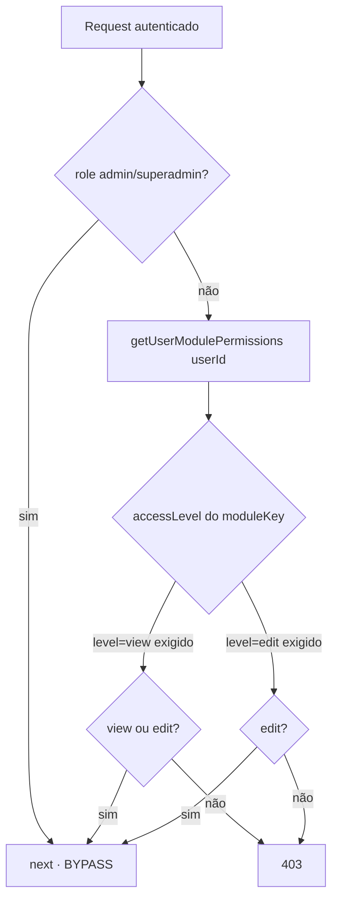
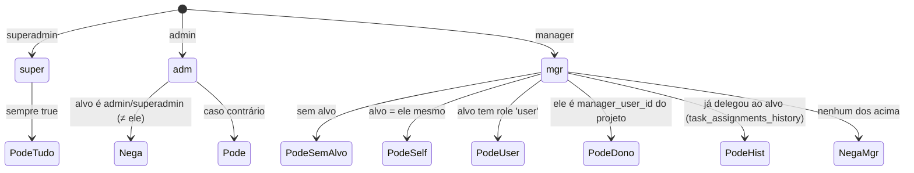

# 07 · Permissões

O PM usa o sistema de permissões granulares do IMPGEO (Fase 2.x): **5 papéis** ×
**nível por módulo** (`view`/`edit`), com defaults por papel e overrides. No backend, cada rota é
gateada por `requireModulePermission(moduleKey, level)`; no front, por `usePermissions(moduleKey)`.
Além disso, ações sobre tarefas têm um **escopo de autoridade** extra (`_canManageTask`).

---

## Módulos do subsistema `gerenciamento`

| moduleKey | Módulo | sortOrder | Acesso típico |
|-----------|--------|:---------:|---------------|
| `dashboard_gerenciamento` | Dashboard | 1 | todos (gestor vê global) |
| `metas_gerenciamento` | Metas | 2 | todos |
| `projecao_gerenciamento` | Projeção | 3 | todos |
| `relatorios_gerenciamento` | Relatórios | 4 | todos |
| `projects` | Projetos | 5 | edit p/ gestão |
| `services` | Serviços | 6 | edit p/ gestão |
| `clients` | Clientes | 7 | edit p/ gestão |
| `tarefas_gerenciamento` | Tarefas | 8 | edit p/ todos (exceto guest) |
| `pomodoro_gerenciamento` | Pomodoro | 9 | edit p/ todos (exceto guest) |
| `relatorios_tarefas_gerenciamento` | Relatórios de Tarefas | 10 | **só admin/superadmin/manager** |

---

## Defaults por papel (de `server/permissions/defaults.js`)

`FALLBACK_DEFAULTS` define o nível por **subsistema**; `moduleOverrides` ajusta módulos específicos.
Recorte para `gerenciamento`:

| Papel | gerenciamento | Observações |
|-------|:-------------:|-------------|
| `superadmin` | edit | tudo edit |
| `admin` | edit | tudo edit (overrides: `sessions`/`anomalies`/`security_alerts` = none) |
| `manager` | edit | sem acesso ao subsistema `admin` |
| `user` | edit | gestão = `view`, financeiro = `view`, **gerenciamento = `edit`** |
| `guest` | view | tudo view (override: `roadmap` = none) |

> Nota: `relatorios_tarefas_gerenciamento` é semeado (migration 052) só para
> `admin`/`superadmin`/`manager` — usuário comum não vê relatórios consolidados, mesmo com
> `gerenciamento = edit`.



---

## `requireModulePermission(moduleKey, level)` (backend)

Em [`server/server.js`](../../server/server.js) (~linha 6747):

```js
function requireModulePermission(moduleKey, level = 'view') {
  return async (req, res, next) => {
    if (!req.user) return res.status(401).json({ error: 'Não autenticado' });
    if (req.user.role === 'admin' || req.user.role === 'superadmin') return next();  // bypass
    const perms = await db.getUserModulePermissions(req.user.id);
    const entry = perms.find(p => p.moduleKey === moduleKey);
    const accessLevel = entry?.accessLevel || null;
    const ok = level === 'view'
      ? (accessLevel === 'view' || accessLevel === 'edit')
      : (accessLevel === 'edit');
    return ok ? next() : res.status(403).json({ error: `Acesso negado ao módulo ${moduleKey}.` });
  };
}
```

> **Lacuna no Alya**: não existe esse middleware genérico no backend (só `requireRulePermission`,
> `requireAdmin`, `requireSuperAdmin`). Os dados (`user_module_permissions`) e o front
> (`hasModuleView`/`hasModuleEdit`) existem — basta **criar** o `requireModulePermission` análogo (F2).

---

## Escopo de autoridade sobre tarefas (`_canManageTask` / `_annotateCanManage`)

Permissão de módulo diz "pode acessar Tarefas"; o **escopo** diz "pode agir nesta tarefa específica /
sobre este usuário-alvo". Em `server.js` (~linha 2345):



- **superadmin**: pode tudo.
- **admin**: pode, exceto agir sobre outro admin/superadmin.
- **manager**: pode sobre si, sobre usuários `user`, sobre tarefas de projetos onde é
  `manager_user_id`, ou sobre quem ele já delegou (consulta `task_assignments_history`). Fora disso, não.
- `_annotateCanManage` aplica essa lógica em lote ao carregar um projeto, anotando `can_manage` e
  `due_action` em cada tarefa (usado pelo front para mostrar/ocultar ações).

`_isManagerRole(u)` = `role ∈ {admin, superadmin, manager}` — atalho usado em várias decisões.

---

## Frontend — `usePermissions(moduleKey)`

[`src/hooks/usePermissions.ts`](../../src/hooks/usePermissions.ts): a partir de `user.role` +
`user.modulesAccess`, retorna `{ canView, canEdit, canCreate, canDelete, canImport, canExport, isLoading }`.
superadmin/admin têm acesso pleno; manager/user/guest seguem o nível granular (`edit`→full,
`view`→somente leitura). Cada módulo PM chama `usePermissions('<moduleKey>')` (ver 06).

---

## Paridade com o Alya

| Peça | IMPGEO | Alya | Ação |
|------|--------|------|------|
| Papéis | 5 (incl. manager) | **5 (incl. manager)** — migration 020 | reusar |
| `user_module_permissions` | sim | sim | reusar |
| `role_default_permissions` | sim | sim — migration 021 | reusar (semear módulos PM) |
| Middleware por módulo (backend) | `requireModulePermission` | **ausente** | **criar** |
| Hook front | `usePermissions` | `usePermissions` + `hasModuleEdit` | reusar |
| `_canManageTask`/`_annotateCanManage` | sim | n/a (vem com o PM) | **portar verbatim** (só `users.role`+`projects`+histórico) |

> Detalhes da concessão de permissões (espelhar migrations 017/052) em [13-ROADMAP-ALYA.md](13-ROADMAP-ALYA.md).
