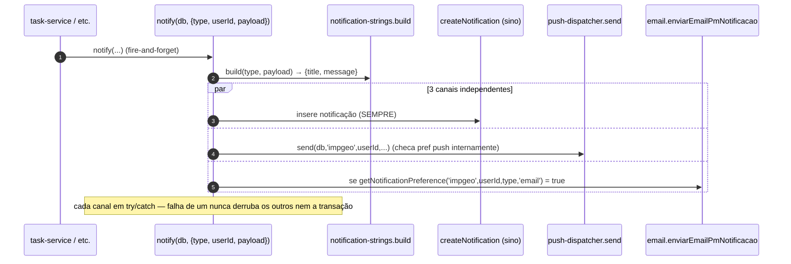
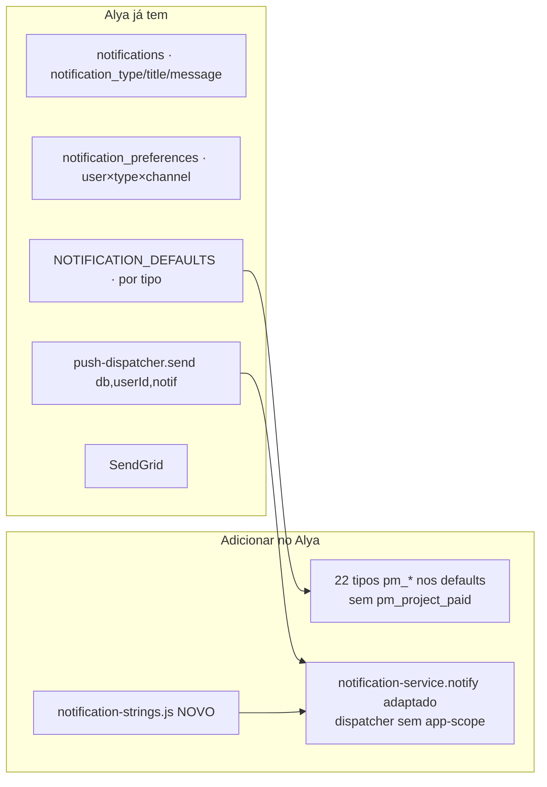

# 08 · Notificações

O PM dispara notificações em **3 canais simultâneos** (fanout): **sino** (in-app), **push** (VAPID) e
**e-mail** (SendGrid, opt-in). Tudo passa por
[`server/services/pm/notification-service.js`](../../server/services/pm/notification-service.js), com
textos centralizados em [`notification-strings.js`](../../server/services/pm/notification-strings.js) e
defaults por tipo em `Database.NOTIFICATION_DEFAULTS.impgeo` (`server/database-pg.js`).

---

## Fanout 3-way



Pontos-chave (do código real):

- **`notify(db, {type, userId, payload, entityType, entityId, ctaProjectId})`**: monta `{title, message}`
  via `strings.build`, grava o sino sempre, dispara push (o dispatcher checa a preferência), e e-mail só
  se a preferência `email` estiver ligada. **Nunca propaga erro** (fire-and-forget).
- **Scope `'impgeo'`**: o IMPGEO é multi-origin (impgeo/tc), então o dispatcher recebe o scope:
  `pushDispatcher.send(db, 'impgeo', userId, ...)`. **No Alya (single-origin) isso vira
  `send(db, userId, ...)`** — adaptação na portabilidade.
- **CTA de e-mail**: `ctaForProject` monta um link `?subsystem=gerenciamento&module=projects&project=<id>`.

### Helpers de público-alvo

| Função | Alvo |
|--------|------|
| `notify(db, args)` | 1 usuário (`args.userId`) |
| `notifyAdmins(db, args)` | todos `admin` + `superadmin` ativos |
| `notifyRoles(db, roles, args)` | todos os papéis dados (respeita `args.exceptUserId`) |
| `notifyManagersAndAdmins(db, args)` | `manager` + `admin` + `superadmin` |

`notifyRoles` itera os usuários ativos do conjunto de papéis e pula `exceptUserId` (ex.: não notificar
quem disparou a ação).

---

## Catálogo dos 23 tipos `pm_*`

`NOTIFICATION_DEFAULTS.impgeo` (push/email default por tipo) — espelhado 1:1 por `notification-strings`:

| Tipo | push | email | Disparado quando |
|------|:----:|:-----:|------------------|
| `pm_task_assigned` | ✓ | — | tarefa atribuída a alguém |
| `pm_task_accepted` | ✓ | — | responsável aceita |
| `pm_task_refused` | ✓ | — | responsável recusa |
| `pm_task_overdue` | ✓ | — | tarefa passa do prazo (cron) |
| `pm_review_requested` | ✓ | — | tarefa enviada p/ revisão |
| `pm_review_decided` | ✓ | — | revisão aprovada/reprovada |
| `pm_help_requested` | ✓ | — | pedido de ajuda |
| `pm_help_accepted` | ✓ | — | ajuda aceita |
| `pm_help_refused` | ✓ | ✓ | ajuda recusada |
| `pm_project_paid` | ✓ | — | projeto pago (PIX) — **poda no Alya** |
| `pm_project_completed` | ✓ | — | projeto concluído |
| `pm_pomodoro_overage_requested` | ✓ | ✓ | pedido de tempo extra |
| `pm_pomodoro_overage_decided` | ✓ | ✓ | tempo extra decidido |
| `pm_due_date_requested` | ✓ | ✓ | alteração de prazo solicitada |
| `pm_due_date_proposed` | ✓ | ✓ | contraproposta de prazo |
| `pm_due_date_decided` | ✓ | ✓ | prazo decidido |
| `pm_task_uncompleted` | ✓ | ✓ | tarefa reaberta (volta ao responsável) |
| `pm_uncomplete_requested` | ✓ | ✓ | reabertura solicitada (aprovação) |
| `pm_uncomplete_decided` | ✓ | ✓ | reabertura decidida |
| `pm_uncomplete_self_notice` | ✓ | ✓ | admin reabriu p/ si (aviso) |
| `pm_review_followup` | ✓ | ✓ | "Revisão final" disponível (pós-aprovação de manager) |
| `pm_delegation_requested` | ✓ | ✓ | delegação aguardando aprovação |
| `pm_delegation_decided` | ✓ | ✓ | delegação decidida |

> Além desses, há a chave `'_meta:foreground'` (push:false/email:false) usada como controle interno.
> **Padrão**: eventos "operacionais imediatos" (atribuir/aceitar) são só push; eventos de
> **aprovação/decisão** (prazo, reabertura, delegação, overage) também mandam e-mail.

---

## Payloads esperados por `build(type, payload)`

Cada string consome campos nomeados do `payload`. Exemplos (de `notification-strings.js`):

```js
pm_task_assigned   → { assignedByName?, taskName, projectName? }
pm_review_decided  → { approved, reviewerName?, taskName, notes? }
pm_due_date_proposed → { byName?, proposedDue?, taskName, note? }
pm_delegation_decided → { approved, decidedByName?, taskName, toName? }
pm_pomodoro_overage_requested → { userName?, workedMinutes?, hard?, limit?, justification? }
```

> Importante: os textos enriquecem com **nomes de atores** (`assignedByName`, `reviewerName`,
> `decidedByName`, `toName`…) — o serviço resolve esses nomes (`_userName`) antes de notificar, para
> que sino e e-mail mostrem "Fulano aprovou…" em vez de "Um gestor…".

---

## Como o Alya recebe isto



O Alya **já tem** o padrão "tipo → defaults push/email + dispatcher + preferências". Falta:
1. **Acrescentar 22 tipos `pm_*`** ao `NOTIFICATION_DEFAULTS` do Alya (todos menos `pm_project_paid`).
2. **Criar** `notification-strings.js` (não existe — lá os textos são inline).
3. **Portar `notify`/`notifyRoles`/…** adaptando à assinatura `send(db, userId, notif)` e ao
   `createNotification`/`getNotificationPreference`/email do Alya.

> Ver mapeamento completo em [11-PORTABILIDADE-ALYA.md](11-PORTABILIDADE-ALYA.md).
