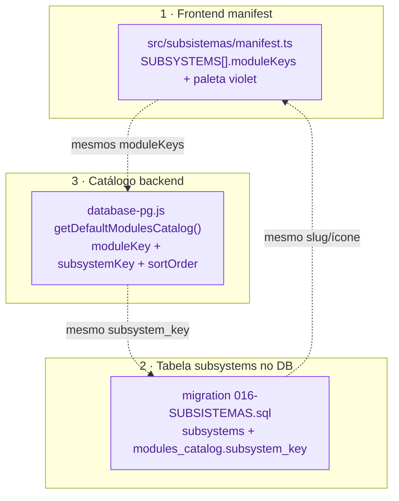
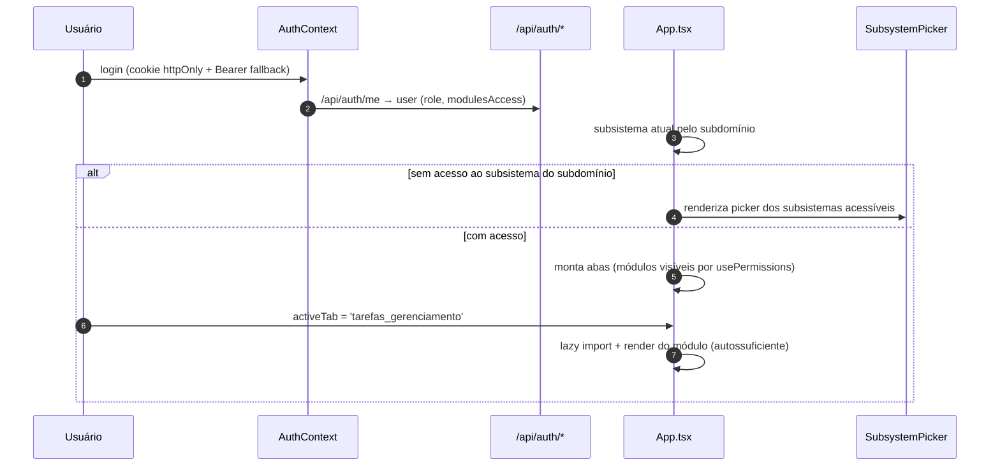

# 09 · Integração com o sistema

O Gerenciamento não é uma ilha: ele se pluga no sistema por **3 pontos de sincronização** (registro do
subsistema e seus módulos) e reusa a infraestrutura de **auth/sessão/notificações/PWA** do IMPGEO.
Esta página mostra como o subsistema "existe" para o resto do sistema.

---

## Os 3 pontos de sincronização

Adicionar/registrar um módulo exige manter **três fontes em concordância** — se divergirem, o módulo
some do menu, perde permissão ou quebra a navegação.



**1 · Manifest (front)** — `src/subsistemas/manifest.ts`:

```ts
{
  key: 'gerenciamento', slug: 'gerenciamento', name: 'Gerenciamento',
  description: 'Projetos, serviços, clientes e indicadores operacionais',
  iconName: 'Workflow',
  moduleKeys: ['dashboard_gerenciamento','metas_gerenciamento','projecao_gerenciamento',
    'relatorios_gerenciamento','projects','services','clients',
    'tarefas_gerenciamento','pomodoro_gerenciamento','relatorios_tarefas_gerenciamento'],
  palette: PALETTES.violet,
}
```

**2 · Tabela `subsystems` (DB)** — `migration 016-SUBSISTEMAS.sql` cria a tabela e a coluna
`modules_catalog.subsystem_key`, e semeia o subsistema `gerenciamento` (slug, ícone, sort_order=4).

**3 · Catálogo (backend)** — `getDefaultModulesCatalog()` em `database-pg.js` lista cada módulo com
`{moduleKey, moduleName, iconName, subsystemKey:'gerenciamento', sortOrder}`. Os módulos do PM que
chegaram **depois** (042+) entram por migrations explícitas que inserem no `modules_catalog` **e**
concedem permissões aos usuários existentes (padrão das migrations **017**, **048**, **049**, **052**).

> **Por que isso importa para o Alya**: o Alya tem exatamente o mesmo trio (manifest +
> `subsystems` da migration 018 + catálogo em `database-pg.js`). Portar o PM = **substituir** as
> entradas do `gerenciamento` (que hoje listam `products`/`clients`) pelos 10 módulos do PM, mantendo
> os 3 pontos sincronizados. Ver 11/13.

---

## Login → seleção de subsistema → módulo



- **Navegação**: sem router; `activeTab` em estado. Módulos PM são lazy-imported em `App.tsx`
  (`TabType` inclui cada moduleKey) e renderizados condicionalmente quando `activeTab` casa **e** o
  usuário tem acesso. Quando falta acesso ao subsistema do subdomínio, o `App` mostra um
  `SubsystemPicker` (em vez de "Acesso negado") com os subsistemas que o usuário pode abrir.
- **Ícones**: `iconName` (Lucide) vem do catálogo; mapeado no `iconMap` do front.

---

## Auth, cookies e impersonation

O PM herda o modelo de autenticação do IMPGEO (ver memória `project-impgeo-auth`):

- **2 contextos**: `Auth` (impgeo) e `TcAuth` (TerraControl) — cookies isolados por domínio
  (`.impgeo.*` vs `.terracontrol.*`). O PM vive no contexto `Auth`.
- **Cookies httpOnly + Bearer fallback**: sessão via cookie httpOnly; fallback de header Bearer.
- **Impersonation** (superadmin "capturar usuário"): transporta o JWT por cookies JS-legíveis
  (`imp_on`/`imp_tok`/`imp_orig`) escopados a `.impgeo.*` para cruzar subdomínios — usado por
  `CapturarUsuarioModal`. *(É um ponto de tech-debt; ver 12.)*

> **No Alya**: single-origin, sem TerraControl e **sem impersonation real no backend**. O PM porta sem a
> camada de impersonation; auth/cookies do Alya (JWT + refresh + httpOnly, domínio `.alya`) já bastam.

---

## PWA e jobs de fundo

- **PWA**: o IMPGEO tem SW único (`public/sw.js`) com dispatcher por hostname; push VAPID. As
  notificações push do PM (ver 08) usam essa infra. O Alya também tem PWA + `push_subscriptions` VAPID.
- **Cron embutido no backend** (não há scheduler externo): `report-service.detectAndMarkOverdue`
  (marca tarefas `overdue` a cada ~1 min) e `report-service.sendDueReports` (relatórios por e-mail).
  Esses jobs precisam ser registrados no boot do Alya ao portar.

---

## Resumo de integração para o Alya

| Ponto | IMPGEO | Alya | Ação |
|-------|--------|------|------|
| 3 sync points | manifest + subsystems(016) + catálogo | manifest + subsystems(018) + catálogo | **substituir** entradas do `gerenciamento` |
| Auth/cookies | Auth + TcAuth | JWT+refresh, `.alya` | reusar (sem TcAuth) |
| Impersonation | sim (cookie JS) | não | **não portar** |
| PWA/push | sw.js + VAPID | PWA + push_subscriptions | reusar |
| Cron | embutido no backend | registrar no boot | **portar jobs** (overdue, reports) |

> Detalhes em [11-PORTABILIDADE-ALYA.md](11-PORTABILIDADE-ALYA.md) e [13-ROADMAP-ALYA.md](13-ROADMAP-ALYA.md).
