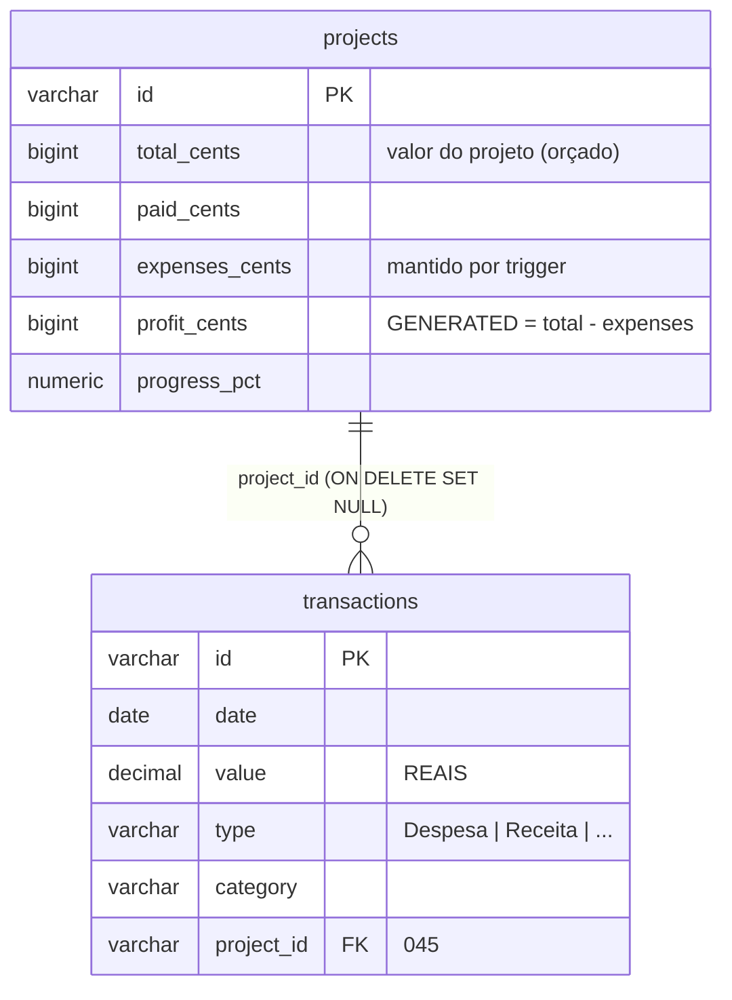
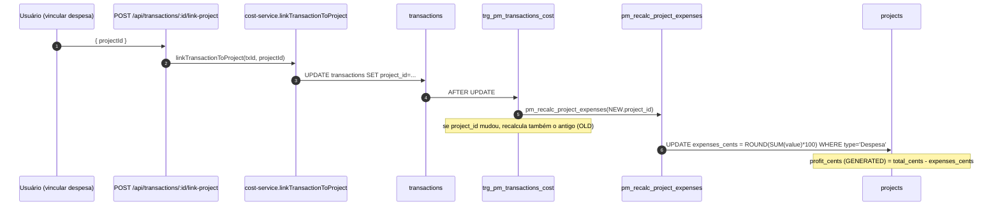
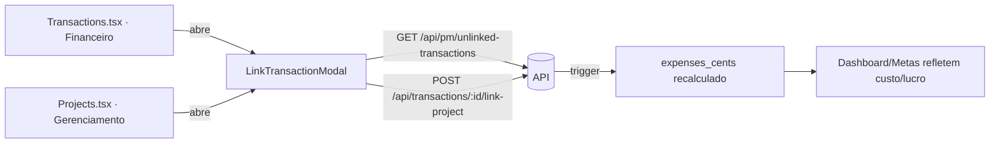
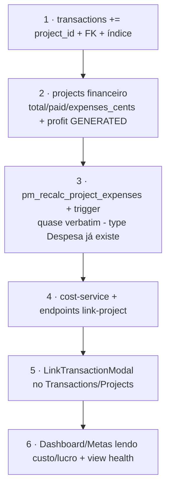

# 10 · Integração com o Financeiro

A conexão entre Gerenciamento e Financeiro é o **vínculo transação ↔ projeto**: cada transação pode
apontar para um projeto (`transactions.project_id`), e o **custo do projeto** é recalculado
automaticamente por **trigger SQL** a partir das despesas vinculadas — alimentando lucro orçado,
relatórios financeiros e o dashboard. É a integração que o usuário pediu para **replicar completa** no Alya.

---

## Modelo do vínculo



`transactions.project_id` foi adicionado na **migration 045** (FK → `projects(id)` com
`ON DELETE SET NULL`, índice `idx_transactions_project_id`). As colunas financeiras de `projects`
(`total_cents`, `paid_cents`, `expenses_cents`, `profit_cents` GENERATED) também vêm da 045.

---

## Trigger de custo (migration 052)



Função e trigger reais:

```sql
CREATE OR REPLACE FUNCTION pm_recalc_project_expenses(p_project_id VARCHAR) RETURNS void AS $$
BEGIN
  IF p_project_id IS NULL THEN RETURN; END IF;
  UPDATE projects
     SET expenses_cents = COALESCE((
           SELECT ROUND(SUM(value) * 100)::BIGINT
             FROM transactions
            WHERE project_id = p_project_id AND type = 'Despesa'
         ), 0),
         updated_at = NOW()
   WHERE id = p_project_id;
END;
$$ LANGUAGE plpgsql;

CREATE TRIGGER trg_pm_transactions_cost
  AFTER INSERT OR UPDATE OR DELETE ON transactions
  FOR EACH ROW EXECUTE FUNCTION pm_transactions_cost_trigger();
```

- Só transações `type='Despesa'` contam como custo; `value` (reais) é convertido para centavos
  (`*100`) para casar com `expenses_cents` (BIGINT).
- No UPDATE, se o `project_id` mudou, **ambos** os projetos (novo e antigo) são recalculados.
- `profit_cents` é coluna **GENERATED** (`total_cents - expenses_cents`) — lucro **orçado** (não realizado).

> **Por que isto porta quase verbatim no Alya**: o `transactions` do Alya já é `value DECIMAL(15,2)` em
> reais com `type='Despesa'`/`'Receita'`. Basta **adicionar `project_id`** + FK + a função/trigger.
> Nenhuma conversão de modelo é necessária — só o `projects` financeiro precisa ser criado.

---

## Camada de serviço e API

`cost-service.js` (só LÊ/vincula — o cálculo é do trigger):

```js
linkTransactionToProject(db, transactionId, projectId)   // projectId=null desvincula
linkTransactionsToProject(db, ids, projectId)            // bulk
getProjectFinancials(db, projectId)                      // projeto + transações vinculadas
```

Endpoints (gate `projects/edit` para escrita, `REL`/`projects/view` para leitura):

| Método | Rota | Uso |
|--------|------|-----|
| POST | `/api/transactions/:id/link-project` | vincular 1 transação |
| POST | `/api/transactions/link-project-bulk` | vincular várias |
| GET | `/api/projects/:id/transactions` | transações do projeto |
| GET | `/api/pm/unlinked-transactions` | despesas sem projeto (picker) |
| GET | `/api/pm/reports/financials` | financeiro do projeto |

---

## "Vincular a projeto" (frontend)



- `_pm/LinkTransactionModal.tsx` (usa `<Modal>`): lista despesas não vinculadas, filtra por
  descrição/valor/data, e vincula ao projeto.
- A interface `Transaction` em `src/subsistemas/financeiro/modulos/Transactions.tsx` já carrega
  `project_id?: string | null` — o Financeiro mostra o vínculo e permite navegar para o modal.
- Dashboard e Metas do Gerenciamento consomem `total/expenses/profit_cents` e a view
  `pm_project_health_v` (`expense_ratio_pct`, `days_to_deadline`) — harmonizados visualmente com o
  Financeiro (mesmos `SectionPanel`/gauges de `charts.tsx`).

---

## Replicação no Alya (resumo)



| Peça | Esforço no Alya |
|------|-----------------|
| `transactions.project_id` + FK | baixo (ALTER) |
| `projects.*_cents` + `profit_cents` GENERATED | baixo (parte do schema PM) |
| trigger de custo | baixo — **porta verbatim** (modelo de `transactions` idêntico) |
| `cost-service` + endpoints | baixo |
| `LinkTransactionModal` + UI | médio (integrar no `Transactions.tsx` do Alya) |
| views `pm_project_health_v`/`pm_overdue_summary_v` | baixo |

> A única diferença real frente ao IMPGEO é a **ausência de `paid_cents` por PIX**: no IMPGEO,
> `paid_cents` é alimentado pelo webhook AbacatePay; no Alya, `paid_cents` fica como entrada manual
> (ou 0), sem o fluxo de pagamento automático. O custo/lucro (que é o que o usuário quer) não depende disso.
