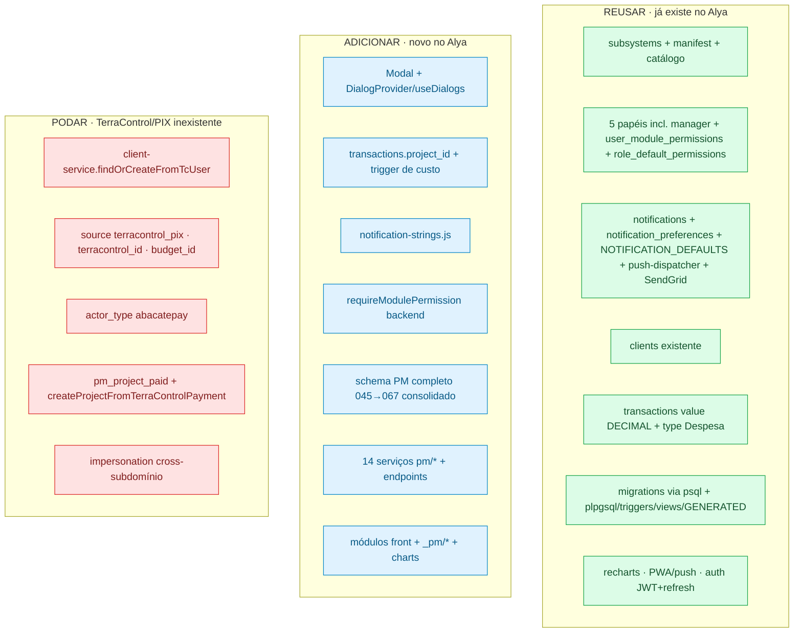
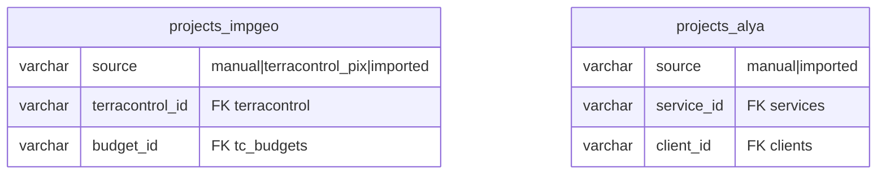

# 11 · Portabilidade para o Alya

O Alya (`/Users/fernandocarvalho/alya`) é da mesma família do IMPGEO (React 18/Vite/TS + Express +
PostgreSQL, subsistemas, permissões granulares, notificações por tipo, migrations via psql). Boa parte
do "encanamento" já existe — então portar o PM é **enxertar** o subsistema, não reconstruí-lo. Esta
página cruza, peça por peça, o que **reusar / adicionar / adaptar / podar**.

> Decisão-base: o PM **substitui** o subsistema `gerenciamento` atual do Alya (hoje Produtos + Clientes).
> Sai `products`; `clients` é **reaproveitada**; os 4 dashboards placeholder viram reais.

---

## Mapa de enxerto

---

## Tabela-mestre de decisão

| Componente IMPGEO | Estado no Alya | Decisão |
|---|---|---|
| Migrations via psql + plpgsql/triggers/views/GENERATED | Igual (psql; plpgsql já usado; sem `schema_migrations`) | **Reusar fluxo** — consolidar 045→067; runner fica como melhoria (doc 12) |
| `transactions.value DECIMAL` reais + `type='Despesa'` | Igual (sem `project_id`) | **Adicionar** só `project_id` + FK + trigger (porta verbatim) |
| `projects` financeiro (`*_cents`, `profit_cents` GENERATED) | Não existe | **Adicionar** integral |
| `clients` (cpf/cnpj/first/last/address JSONB) | **Já existe** (com encryption), sem campos PM | **Estender**; não recriar; **dropar** `tc_user_id` |
| `client-service.findOrCreateFromTcUser` | Sem TerraControl | **Podar** — só CRUD de clients |
| `source='terracontrol_pix'`, `terracontrol_id`, `budget_id`, `actor_type='abacatepay'` | Sem PIX/AbacatePay | **Podar** dos CHECKs/colunas |
| `pm_project_paid` + criação por webhook PIX | Sem webhook | **Podar** — projeto nasce manual/template |
| `NOTIFICATION_DEFAULTS` + `notification_preferences` + `push-dispatcher` | **Já existe** (dispatcher `send(db,userId,notif)`) | **Reusar**; **acrescentar** 22 tipos `pm_*` (sem `pm_project_paid`) |
| `notification-strings.js` (`build(type,payload)`) | **Não existe** (strings inline) | **Adicionar** arquivo novo |
| `notification-service.notify/notifyRoles/...` | Equivalente parcial | **Portar adaptando** ao dispatcher do Alya (sem app-scope) + email/createNotification |
| `requireModulePermission(moduleKey, level)` (backend) | **Não existe genérico** (tem `requireRulePermission`/`requireAdmin`) | **Criar** sobre `user_module_permissions` |
| `_canManageTask`/`_annotateCanManage` | Papéis iguais (5, incl. manager) | **Portar verbatim** |
| `Modal` + `DialogProvider`/`useDialogs` | **Não existem** | **Adicionar** (F0) |
| Módulos PM autossuficientes | App.tsx monolítico (props), recharts só no admin | Inserir no `if/switch` como self-contained |
| Subsistema `gerenciamento` (`products`+`clients`+4 dashboards) | Existe | **Substituir**: sai `products`, fica `clients`, dashboards reais |
| Impersonation cross-subdomínio | Sem subdomínios/impersonation real | **Não portar** |
| PWA/push (VAPID), recharts, auth JWT+refresh | Existem | **Reusar** |
| Cron embutido (overdue, reports) | n/a | **Portar jobs** no boot |

---

## O que muda no schema (poda concreta)

- `projects.source` no Alya: CHECK `('manual','imported')` (sem `terracontrol_pix`).
- Remover colunas/FKs `terracontrol_id`, `budget_id`.
- `project_events.actor_type`: CHECK `('user','system','cron')` (sem `abacatepay`).
- `clients`: **não** criar — estender a existente; sem `tc_user_id`. Adicionar
  `cpf`/`cnpj`/`source`/`first_name`/`last_name` e migrar `address` para JSONB se ainda não for.
- Seed `svc_terracontrol_default` (046): **não** levar (é o serviço do TerraControl). Opcional: criar
  um serviço-exemplo genérico para validar o fluxo de template.

---

## O que muda no backend

- `client-service.js`: manter só CRUD; remover `findOrCreateFromTcUser`/sync `tc_users`.
- `project-service.js`: remover `createProjectFromTerraControlPayment` e `TC_SERVICE_ID`.
- `notification-service.js`: trocar `pushDispatcher.send(db,'impgeo',userId,...)` por
  `send(db, userId, ...)`; usar `createNotification`/`getNotificationPreference`/email do Alya.
- Criar `requireModulePermission(moduleKey, level)` (espelha o do IMPGEO sobre `user_module_permissions`).
- Mapear cada rota PM para o `server.js` do Alya (mesma assinatura; mesmos gates).

## O que muda no frontend

- Portar `Modal` + `DialogProvider` + montar o provider no root (F0).
- Portar `_pm/charts.tsx` (recharts já existe no Alya).
- Inserir os 10 módulos no `if/switch`/menu dinâmico do `App.tsx` (eles são self-contained → não
  precisam do prop-drilling de estado do Alya).
- Ajustar imports de auth/permissões para os hooks do Alya (`usePermissions` + `hasModuleEdit`).

---

## O que NÃO porta (e por quê)

| Item | Motivo |
|------|--------|
| TerraControl / `tc_users` / PIX / AbacatePay / webhook | Não existem no Alya |
| `pm_project_paid` + projeto-por-pagamento | Depende do webhook PIX |
| Impersonation cross-subdomínio | Alya é single-origin, sem impersonation real no backend |
| Seed `svc_terracontrol_default` | Serviço específico do domínio TerraControl |

> A sequência executável dessa portabilidade — com migrations a criar, arquivos a portar e QA — está em
> [13-ROADMAP-ALYA.md](13-ROADMAP-ALYA.md). As melhorias técnicas que valem para **ambos** os
> sistemas estão em [12-MELHORIAS-TECNICAS.md](12-MELHORIAS-TECNICAS.md).
