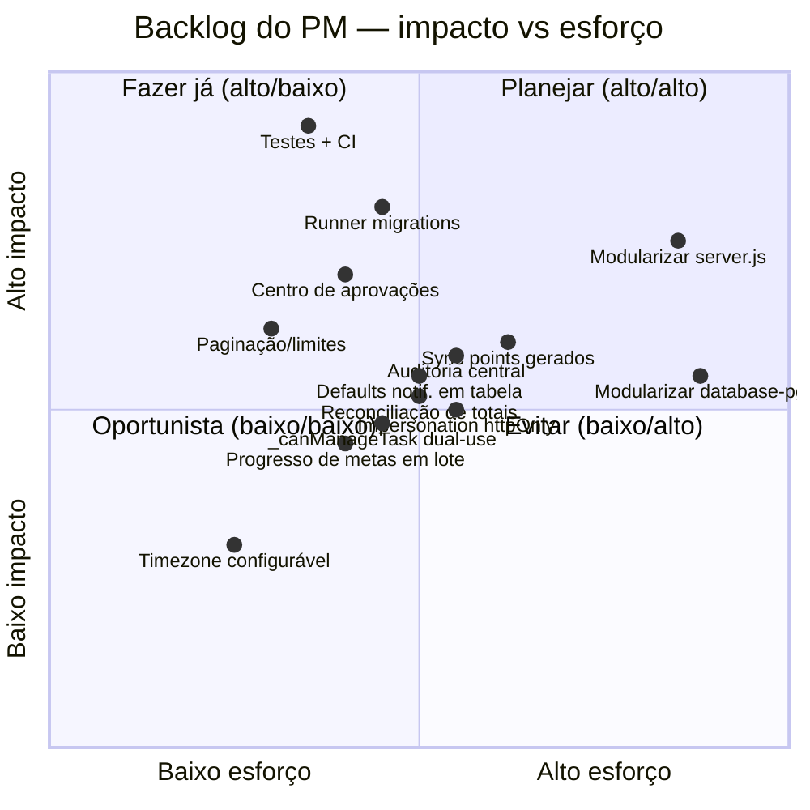

# 12 · Melhorias técnicas (backlog priorizado — IMPGEO)

> Este documento é **advisory**: lista dívidas técnicas e melhorias do subsistema Gerenciamento (e do
> "encanamento" que ele usa) no **IMPGEO**. Nada aqui está implementado; serve para priorizar trabalho
> futuro. Algumas valem também para o Alya (marcadas **[ambos]**) e devem ser consideradas ao portar.

Cada item segue o formato **problema / impacto / proposta / esforço / risco**.

---

## Priorização (impacto × esforço)

---

## Backlog

### 1. Testes versionados + CI **[ambos]**
- **Problema**: os ~9 arquivos de teste do PM (`server/services/pm/__tests__/`) são **gitignored**
  (regra `*.md`/`*-spec`/`__tests__`), rodam só local; não há CI.
- **Impacto**: regressões silenciosas em fluxos críticos (negociação de prazo, delegação, reabertura,
  revisão por papel) que evoluíram muito.
- **Proposta**: versionar os testes, ampliar cobertura desses fluxos, GitHub Actions (lint + vitest no PR).
- **Esforço**: médio · **Risco**: baixo.

### 2. Runner de migrations + `schema_migrations` **[ambos]**
- **Problema**: migrations aplicadas **à mão via psql**; nenhum dos dois projetos rastreia o que já foi
  aplicado (o `npm run migrate` do Alya é só migração de dados JSON→PG).
- **Impacto**: risco de drift entre ambientes; ordem/idempotência por convenção, não por ferramenta.
- **Proposta**: runner idempotente que lê `server/migrations/*.sql` em ordem e registra em
  `schema_migrations`; manter os pares `-rollback.sql`.
- **Esforço**: médio · **Risco**: médio (precisa baseline dos ambientes existentes).

### 3. Modularizar `server.js` — ✅ CONCLUÍDO · 2026-07-09
> A parte do data-layer (`database-pg.js`) foi promovida para o **item #15** (esforço à parte, mais arriscado).
- **Problema**: arquivo gigante (`server.js` ~9k linhas).
- **Impacto**: navegação difícil, conflitos de merge, acoplamento.
- **Proposta**: extrair routers por domínio (ex.: `routes/pm.js`); sem mudar comportamento.
- **Esforço**: alto · **Risco**: médio (mudança ampla — fazer incremental, com testes).
- **Resultado**: `server.js` **9798 → 1112 linhas (−89%)** em 15 rodadas incrementais, extraindo **15 routers por
  domínio** em `server/routes/`: `pm`, `financeiro`, `content`, `terracontrol`, `tc-auth`, `admin`, `notifications`,
  `transactions`, `user-profile`, `tc-users`, `auth`, `import-export`, `sessions`, `asaas`, `misc`. Cada router é um
  factory `({deps}) => express.Router()` com dependências injetadas; rotas movidas verbatim, **comportamento idêntico**
  (refactor puro — sem migration, sem mudança de frontend). O `server.js` não registra mais nenhuma rota diretamente —
  ficou só com o kernel (bootstrap, middlewares globais, multer, guards/helpers/cookies compartilhados injetados nos
  routers, error handler, `app.listen` + timers) + os 15 mounts. Verificação por rodada: `node -c` + boot real +
  enumeração de rotas + **152 testes verdes**; blocos sensíveis (auth/sessions) com cross-check de símbolos.

### 4. `_canManageTask` dual-use
- **Problema**: a mesma função decide "pode agir na tarefa" e "pode atribuir ao alvo", com `targetUserId`
  ora sendo o assignee, ora o alvo da ação.
- **Impacto**: difícil de raciocinar; efeitos colaterais sutis.
- **Proposta**: separar em `canActOnTask(task)` e `canAssignTo(actor, targetUser)`.
- **Esforço**: médio · **Risco**: médio (tocar autorização — cobrir com testes antes).

### 5. Progresso de metas calculado por listagem
- **Problema**: `goals-service` recomputa o progresso **ao vivo** por meta (N queries) a cada listagem.
- **Impacto**: custo cresce com nº de metas/usuários.
- **Proposta**: cálculo em lote (1 query por métrica) ou cache/materialização com invalidação.
- **Esforço**: médio · **Risco**: baixo.

### 6. 3 pontos de sincronização frágeis **[ambos]**
- **Problema**: manifest TS + tabela `subsystems` + seed `getDefaultModulesCatalog` precisam concordar à mão.
- **Impacto**: divergência → módulo some do menu / sem permissão.
- **Proposta**: gerar de uma fonte única (ex.: manifest → seed) ou validar consistência no boot/CI.
- **Esforço**: médio · **Risco**: baixo.

### 7. Notificações: defaults hardcoded + i18n **[ambos]**
- **Problema**: `NOTIFICATION_DEFAULTS` vive no código; `notification-strings` é "i18n-ready" mas só pt-BR.
- **Impacto**: mudar default exige deploy; sem UI de gestão; sem multi-idioma.
- **Proposta**: tabela de defaults + UI; estrutura de i18n para os textos.
- **Esforço**: médio · **Risco**: baixo.

### 8. Auditoria central do PM **[ambos]**
- **Problema**: há `project_events`/`task_events` por entidade, mas não um audit-log transversal do PM.
- **Impacto**: investigação cross-entidade trabalhosa.
- **Proposta**: padronizar num audit-log central (o Alya tem `audit_logs`/`activity_logs` reusáveis).
- **Esforço**: médio · **Risco**: baixo.

### 9. Impersonation via cookie JS-legível — ✅ CONCLUÍDO · 2026-07-09
- **Problema**: o JWT de impersonation é guardado em cookie legível por JS para cruzar subdomínios.
- **Impacto**: superfície de risco (XSS lê o token).
- **Proposta**: impersonation com cookie httpOnly server-set por subdomínio, ou troca por token de curta duração.
- **Esforço**: médio · **Risco**: médio. *(Não afeta o Alya — lá não há impersonation.)*
- **Resultado**: token de impersonation migrado para **cookie httpOnly server-set** (`impersonationToken`,
  `Domain=.impgeo.*`, 2h) — cruza subdomínios nativamente, JS não lê. Removidos os cookies JS-legíveis
  `imp_on/imp_tok/imp_orig` do frontend. `extractAccessToken` (extraído para `utils/token-extraction.js`,
  testado) prioriza o cookie de impersonation > header > accessToken; `/auth/verify` expõe
  `impersonation:{active,originalUsername}` para a UI detectar o estado ao cruzar subdomínio; `/impersonate/stop`
  reescrito server-side (limpa o cookie, sem depender de token em JS); `/logout` também limpa. Fallback dev
  cross-port mantido via `sessionStorage` (per-origem, não é o cookie-pai). **Nota de rollout**: o deploy
  expôs bugs latentes da modularização (#3) — imports órfãos de require-desestruturado em 6 routers (login
  degradado, impersonation/logout/etc. quebrados) e a ordem `/impersonate/:userId` antes de `/stop` (403 no
  encerramento); ambos corrigidos com testes-guarda (`router-imports`, `route-ordering`).

### 10. Denormalização frágil (totais por trigger)
- **Problema**: `expenses_cents`/`progress_pct` mantidos por trigger — se um trigger falhar/for desabilitado, dessincroniza.
- **Impacto**: números errados em dashboards/relatórios.
- **Proposta**: documentar invariantes + job de reconciliação periódico + testes de trigger.
- **Esforço**: baixo · **Risco**: baixo.

### 11. Centro unificado de pendências/aprovações
- **Problema**: prazo, reabertura, delegação, revisão e overage vivem em seções separadas no front.
- **Impacto**: gestor precisa caçar pendências em vários lugares.
- **Proposta**: uma "caixa de aprovações" única que agrega todas as filas.
- **Esforço**: médio · **Risco**: baixo.

### 12. Paginação/limites **[ambos]**
- **Problema**: `available-tasks`, dashboards e reports não paginam (alguns têm `LIMIT` fixo).
- **Impacto**: degradação com volume.
- **Proposta**: paginação cursor/offset + limites configuráveis; sinalizar truncamento na UI.
- **Esforço**: baixo · **Risco**: baixo.

### 13. Timezone hardcoded
- **Problema**: `America/Sao_Paulo` fixo no cálculo de "dia" do Pomodoro/relatórios.
- **Impacto**: incorreto para usuários/empresas em outro fuso.
- **Proposta**: timezone por usuário/organização (config), default BRT.
- **Esforço**: baixo · **Risco**: baixo.

### 14. Reconciliação de totais / health checks
- **Problema**: sem verificação de que `expenses_cents` bate com a soma real das despesas.
- **Impacto**: drift silencioso (relacionado ao #10).
- **Proposta**: endpoint/job de health que recomputa e compara, alertando divergências.
- **Esforço**: baixo · **Risco**: baixo.

### 15. Modularizar o data-layer (`database-pg.js`)
> Desmembrado do #3 (que cobriu só o `server.js`). O #3 fechou com o `server.js` em 1112 linhas / 15 routers;
> falta o data-layer, que é um esforço à parte e mais arriscado.
- **Problema**: `database-pg.js` é **uma classe `Database` de ~7,5k linhas** com **~339 métodos** e **~770 usos de
  `this.`** (métodos chamam uns aos outros e compartilham `this.pool`/caches). Instanciada uma vez em `server.js`
  (`const db = new Database()`) e injetada inteira nos 15 routers como `db`. Distribuição aproximada: terracontrol ~82 ·
  financeiro ~51 · auth/users/roles/modules ~49 · notificações ~29 · infra/genéricos ~116 · pm ~9 · audit ~3.
- **Impacto**: navegação difícil e conflitos de merge (menor que o do `server.js` — só 1 consumidor e métodos estáveis);
  acoplamento interno alto pelo `this`.
- **Referência do "certo"**: o PM já segue o padrão desejado — a lógica vive em `services/pm/*` (services **stateless**
  que recebem `db` por parâmetro), por isso só restam ~9 métodos de PM na classe. É o molde de decoplamento a mirar.
- **Opções de abordagem**:
  - **A · Split por mixin** — manter 1 instância `db`, mover grupos de métodos p/ arquivos (`db/terracontrol.js` etc.) e
    reagregar via `Object.assign(Database.prototype, …)`. `db.foo()` segue igual, **routers intocados**. *Risco baixo,
    mas ganho só de navegação — o acoplamento `this` permanece (cosmético).*
  - **B · Repositories** — extrair grupos em repos que recebem o pool (`new TerraControlRepo(pool)`) e injetar os repos
    nos routers no lugar do `db` monolítico. *Decoplamento real, mas toca **todos os 15 routers** (reescrever call-sites)
    + resolver os `this.` cross-domínio → refactor de várias sessões. Risco alto.*
  - **C · Não mexer agora** — deixar como está; no máximo migrar os `CREATE TABLE IF NOT EXISTS` inline do
    `ensureProfileSchema()` para migrations versionadas (o runner do #2 já suporta), tirando efeito colateral do boot e
    centralizando o schema **sem tocar nos 339 métodos**. *Risco mínimo, ganho concreto e isolado.*
- **Recomendação**: **C por ora** (o `database-pg.js` não é gargalo hoje; A é cosmético; B só compensa se virar dor real
  de merge/manutenção). O passo barato de valor concreto é migrar o schema inline do `ensureProfileSchema` para migrations.
- **Esforço**: alto (B) / baixo (A, C) · **Risco**: alto (B) / baixo (A, C).

---

## Sugestão de ordem (alto impacto / baixo-médio esforço primeiro)

1. **Testes + CI** (#1) — destrava tudo o resto com segurança.
2. **Runner de migrations** (#2) — base para evoluir schema sem drift.
3. **Paginação** (#12) + **Reconciliação de totais** (#10/#14) — riscos de produção baratos de mitigar.
4. **Centro de aprovações** (#11) — alto valor de produto.
5. **Defaults de notificação em tabela** (#7) + **sync points gerados** (#6).
6. **Modularizar `server.js`** (#3) — ✅ concluído (9798→1112 linhas, 15 routers).

Fora da ordem original (menor prioridade / sem sequenciamento): **#4, #5, #8, #9, #13** e **#15** (data-layer
`database-pg.js`, desmembrado do #3 — ver opções A/B/C; recomendação: C por ora).

> Para o Alya, considerar implementar **#2, #6, #7, #12** já no port (custo marginal baixo enquanto se
> escreve o código novo). Ver [13-ROADMAP-ALYA.md](13-ROADMAP-ALYA.md).
