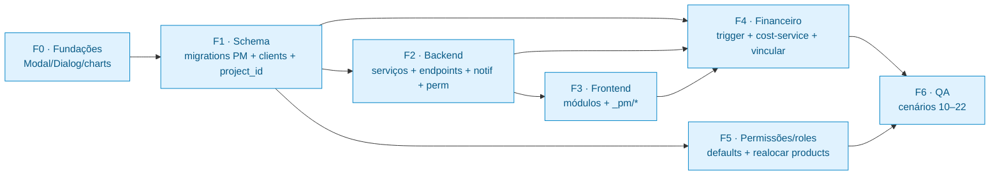
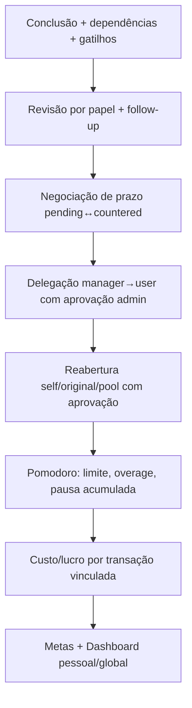

# 13 · Roadmap Alya (execução)

Plano acionável para enxertar o subsistema Gerenciamento (PM) no Alya, em **7 fases ordenadas**
(F0→F6). Cada fase lista o que criar/portar e um critério de "pronto". A base conceitual está em
[11-PORTABILIDADE-ALYA.md](11-PORTABILIDADE-ALYA.md); os contratos, nos docs 02–10.

---

## Dependências entre fases

---

## F0 · Fundações (UI base)

- Portar `src/components/Modal.tsx` (portal, z-index alto, ESC, click-outside, scroll lock).
- Portar `src/components/DialogProvider.tsx` + `useDialogs()` (confirm/alert/prompt) e **montar o
  provider no root** do Alya.
- Portar `_pm/charts.tsx` (recharts já existe no Alya — hoje só em Admin/Statistics; confirmar disponível no escopo geral).
- **Pronto quando**: um modal de teste abre/fecha via `<Modal>` e `useDialogs().confirm()` funciona.

## F1 · Schema (migrations PM consolidadas)

- Criar migrations novas no Alya consolidando **045→067**, **com poda do TerraControl**:
  - `projects`: colunas + financeiro (`*_cents`, `profit_cents` GENERATED) + `status` pt + `source ∈
    ('manual','imported')`; **sem** `terracontrol_id`/`budget_id`.
  - `clients`: **estender** a existente (cpf/cnpj/source/first_name/last_name/address JSONB); **sem** `tc_user_id`.
  - Templates (`service_template_*`), instâncias (`project_stages`, `project_tasks` 10 estados,
    `project_task_deps/triggers`), `task_events`/`project_events` (actor_type sem `abacatepay`).
  - Pomodoro (`task_work_sessions`, `pomodoro_events`, `pomodoro_daily_stats`, `user_pomodoro_config`,
    `task_idle_tracking`) + trigger seed-config.
  - Revisão/anexos/ajuda, requests (prazo/reabertura/delegação), `pm_goals`, `pm_report_jobs`.
  - `transactions += project_id` + FK + índice.
- Sincronizar **3 pontos**: `manifest.ts` (trocar moduleKeys do `gerenciamento`), tabela `subsystems`,
  catálogo `getDefaultModulesCatalog()` (substituir `products`; manter `clients`; adicionar os módulos PM).
- **Pronto quando**: `psql \d project_tasks` mostra os 10 estados e o trigger seed-config existe.

## F2 · Backend (serviços + endpoints)

- Portar os 14 serviços `server/services/pm/*`:
  - `client-service` **simplificado** (sem `findOrCreateFromTcUser`).
  - `project-service` **sem** `createProjectFromTerraControlPayment`/`TC_SERVICE_ID`.
  - `notification-service` adaptado ao dispatcher do Alya (`send(db, userId, notif)`), `createNotification`,
    `getNotificationPreference`, email do Alya.
- Criar `requireModulePermission(moduleKey, level)` (sobre `user_module_permissions`).
- Portar as rotas (ver 05) para o `server.js` do Alya, com os mesmos gates.
- Notificações: **acrescentar 22 tipos `pm_*`** ao `NOTIFICATION_DEFAULTS` do Alya (todos menos
  `pm_project_paid`) + **criar** `notification-strings.js`.
- Registrar os **cron jobs** (`detectAndMarkOverdue`, `sendDueReports`) no boot.
- **Pronto quando**: criar projeto a partir de template via API materializa etapas/tarefas e
  `completeTask` libera dependentes + dispara gatilhos.

## F3 · Frontend (módulos)

- Portar `Tarefas`, `DashboardGerenciamento`, `MetasGerenciamento`, `Projects`, `Services`, `Clients`,
  `Pomodoro`, `RelatoriosTarefas` (+ `ProjecaoGerenciamento`/`RelatoriosGerenciamento`).
- Portar todo `_pm/*` (modais, `ProjectDetailPage`, `ServiceTemplateEditor`, `PomodoroFloatingWidget`,
  `taskApi.ts`/`pomodoroApi.ts`).
- Registrar no `if/switch`/menu dinâmico do `App.tsx` (módulos self-contained — buscam seus dados).
- Ajustar imports de auth/permissões para os hooks do Alya.
- **Pronto quando**: o menu mostra as abas do PM e o fluxo "criar projeto → atribuir → concluir → revisar" roda na UI.

## F4 · Financeiro

- Validar o trigger de custo (porta verbatim — `transactions.value DECIMAL` + `type='Despesa'` já existem).
- Portar `cost-service` + endpoints (`link-project`, `link-project-bulk`, `unlinked-transactions`, `reports/financials`).
- Integrar `LinkTransactionModal` no `Transactions.tsx` (Financeiro) e em `Projects.tsx` (Gerenciamento).
- Harmonizar Dashboard/Metas lendo `total/expenses/profit_cents` + view `pm_project_health_v`.
- **Pronto quando**: vincular uma despesa a um projeto recalcula `expenses_cents` e o lucro aparece no dashboard.

## F5 · Permissões/roles

- Semear defaults por papel do novo subsistema em `role_default_permissions` (espelhar a matriz de
  `permissions/defaults.js`: manager/user = edit em gerenciamento; guest = view; `relatorios_tarefas_*`
  só admin/superadmin/manager).
- Conceder permissões dos novos módulos aos usuários existentes (espelhar migration **017**/**052**).
- Realocar/remover o módulo `products` (e a tabela, se não for mais usada).
- **Pronto quando**: um usuário comum vê Tarefas/Pomodoro (edit) mas não Relatórios de Tarefas.

## F6 · QA (cenários 10–22)

Rodar os mesmos cenários validados no IMPGEO, agora sem os fluxos PIX/TerraControl:

- **Pronto quando**: todos os cenários passam e os números do dashboard batem com os dados reais.

---

## Checklist consolidado

| Fase | Entregáveis-chave | Pronto quando |
|------|-------------------|---------------|
| F0 | Modal, DialogProvider, charts | modal + confirm funcionam |
| F1 | migrations PM + clients estendida + project_id + 3 sync points | `\d project_tasks` ok + triggers |
| F2 | 14 serviços + endpoints + requireModulePermission + notif (22 tipos + strings) + cron | criar-de-template + completeTask |
| F3 | módulos + `_pm/*` no App.tsx | fluxo na UI |
| F4 | trigger custo + cost-service + vincular | custo/lucro no dashboard |
| F5 | role_default_permissions + concessão + realocar products | acesso correto por papel |
| F6 | cenários 10–22 | todos passam |

> Sugestão: implementar já no port as melhorias **#2 (runner)**, **#6 (sync gerado)**, **#7 (defaults em
> tabela)** e **#12 (paginação)** do [12-MELHORIAS-TECNICAS.md](12-MELHORIAS-TECNICAS.md) — custo
> marginal baixo enquanto o código é novo.
